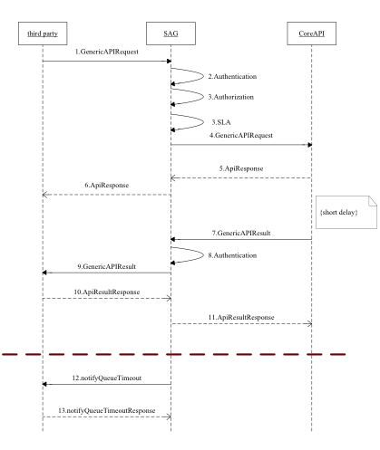

# B2C API Specification


# Approvals    

##  This document needs below approvals for implementation   


  **Author(s)**                         | **Name**         |**Signature**    |  **Date**
----------------------------------------|-----------------|------------------|-------------
 Service Development Engineer           | Eneth Kubai      |                 |
 
 
  **Reviewers**                          |  **Name**        |   **Signature**|    **Date**
  ---------------------------------------|------------------|----------------|---------------
 Senior Manager Service Development      | Reginald Tole    |                |

## Revision Log

   **Revision Number**|  **Revision Date**   | **Revision**  |**Revision made by**
-----------------------|-----------------------|--------------|--------------------
   1.0                 | 18th June, 2013      | Initial Draft  |Eneth Kubai
   1.1                 | 9^th^ July, 2013      |Added section 3.8.1: Password Encryption | Eric Mokaya
   1.2                 |   29^th^ July 2013   |  Added Result codes  | Eneth Kubai
   1.3                 | 13^th^ Jan 2014    | Added Result code explanations  | Eneth Kubai
   1.4                 |  ^th^ Sept 2014     |Added changePassword interface, edited queryTransaction Interface, edited OriginatorConversationId field restrictions. Removed encrypted parameter tag. Edited the genericAPI request, response and result, added result and response codes   | Eneth Kubai
   1.5                 |   11^th^ Nov 2014     | Attached SSL Guide       | Eneth Kubai


### References 

  **Document**  | **Author** |    **Name**
  --------------|-----------|--------------------
                |Eneth Kubai |   Response and Result Codes V1.0
                | John Barii |    SSL Guide

## Abbreviations

   **Term**    | **Definition**
-------------|------------------------------------
 API        | Application Programming Interface
 B2C        | Business to Customer
 Broker     | Service Access Gateway
 SP         | Service Provider

# Introduction

## Scope

The present document specifies the real time B2C Web Service aspects of the interface. All aspects of B2C Web Service are defined here,
these being:

- Message Flow Description

- Data Type Definition

- Web Service Interface Definition

- WSDL for this specification

- Example

## Message Flow Description


##  Data Type Definition

###   IdentityType enumeration

  List of IdentityType values.

   Enumeration   | Description
   --------------|---------------
   1000          | Customer
   2000          | SPOperator
   3000          | OrganizationOperator
   5000          | Organization
   6000          | Till
   8000          | SP

### IdentifierType enumeration

 List of IdentityType values.

   Enumeration  |  Description
  --------------|--------------------------------
   1            |  MSISDN
   2            |  TillNumber
   3            |  SPShortCode
   4            |  OrganizationShortCode
   5            |  IdentityID
   6            | O2CLink
   9            | SPOperatorCode
   10           | POSNumber
   11           | OrganizationOperatorUserName
   12           | OrganizationOperatorCode
   13           | VoucherCode

### ParameterType structure

  Element name  | Element type   |Optional    | Description
  --------------|----------------|------------|----------------------------------
  Key           |xsd:string      | No         | It indicates a parameter name.
  Value         | xsd:string     | No         |> It indicates a parameter value.

### Parameters structure

  Element name   | Element type   |      Optional   | Description
  ---------------|----------------|-----------------|---------------
  Parameter      | ParameterType[1..unbounded]||   No | It is used to carry specific parameters for specific transaction or business operation.

### ReferenceData structure

  Element name  |  Element type    |                Optional|   Description
-----------------|------------------|-----------------------|-----------------------
  ReferenceItem  | ParameterType[1..unbounded] |  No    |     It is used carry some reference data that MM need not analyze but need to record it into transaction log..

### Transaction structure


  Element name     |          Element type  |  Optional |  Description
--------------------|-----------------------|-----------|----------------
  CommandID  |        xsd:string |     No   |      The unique identifier of transaction/business operation. Max length is 64.eg
                                                        
                                                        -   *SalaryPayment *
                                                        
                                                        -   *BusinessPayment*
                                                        
                                                        -   *BusinessPaymentWithWithdrawalChargePaid*
                                                        
                                                        -   *SalaryPaymentWithWithdrawalChargePaid*
                                                        
                                                        -   *PromotionPayment*
                                                        
                                                        -   *TransferFromBankToCustomer*

  LanguageCode |              xsd:string |     Yes    |    It indicates language. It’s reserved.
  OriginatorConversationID|   xsd:string  |    No    |     The unique identifier of the request message generated by third party. It is used to identify a request between the third party and MM. Max length is 128.
                                                        
                                                        Field must start with the B2C organisation short and name of organisation. Eg.
                                                        
                                                        232323\_KCBOrg\_XXXXXX
                                                        
                                                        XXXXX must be unique for every transaction.

  ConversationID       |      xsd:string   |   Yes    |    The unique identifier generated by MM for a previous request message. It is used to support communication multi-times between the third party and MM for one operation/transaction.

  Remark          |           xsd:string |     Yes   |     The remark information about this operation. Max length is 255

  EncryptedParameters   |     xsd:string  |    Yes   |     It is used to carry the value for the element Parameters which are encrypted.\
                                                        The value for this parameter should be a CDATA and encode with base64

  Parameters       |          Parameters |     Yes   |     It is used to carry specific parameters for specific transaction or business operation.\
                                                        If the element EncryptedParameters presents, this parameter should not present.

  ReferenceData  |            ReferenceData |  Yes  |      It is used carry some reference data that MM need not analyze but need to record it into transaction log.

  Timestamp         |         xsd:string  |    No    |     The timestamp generated by the third party.


Caller structure
----------------

  ---------------------------------------------------------------------------------------------------------------------------------------------------------------------------------------------------------------------------
  Element name   Element type   Optional   Description
  -------------- -------------- ---------- ----------------------------------------------------------------------------------------------------------------------------------------------------------------------------------
  CallerType     xsd:integer    No         Indicates the type of the caller:\
                                           2-APICaller\
                                           3-Other(Reserved)

  ThirdPartyID   xsd:string     No         The unique identifier of a third party system defined in MM. It indicates the third party which initiates the request. Max length is 20

  Password       xsd:string     Yes        This security credential of the ThirdPartyID defined in MM. If the password feature for third party is used in MM, then this parameter must be presented in the request message.

  CheckSum       xsd:string     Yes        Currently it is unused. It is reserved for API security.

  ResultURL      xsd:string     Yes        It indicates the destination URL where Broker should send the result message to.
  ---------------------------------------------------------------------------------------------------------------------------------------------------------------------------------------------------------------------------

Initiator structure
-------------------

  ---------------------------------------------------------------------------------------------------------------------------------------------------------------------------------------------------------
  Element name         Element type     Optional   Description
  -------------------- ---------------- ---------- --------------------------------------------------------------------------------------------------------------------------------------------------------
  IdentifierType       IdentifierType   No         It indicates the identifier type of the initiator. The value of this parameter must be a valid identifier type supported by MM.

  Identifier           xsd:string       No         It indicates the identifier of the initiator. Its value must match the inputted value of the parameter IdentifierType.

  SecurityCredential   xsd:string       No         It indicates the security credential of the initiator. Its value must match the inputted value of the parameter IdentifierType.

  ShortCode            xsd:string       No         When the initiator is an organization operator, this parameter must be present in the request to indicate which organization the operator belongs to.\
                                                   If the initiator is not an organization operator, this parameter should not be present.
  ---------------------------------------------------------------------------------------------------------------------------------------------------------------------------------------------------------

### Password Encryption

The Caller will be required to confirm its authority to act on behalf of
the Initiator (in other words, a specific B2C organisation) by
presenting the user name and password for the Initiator, the latter
encrypted with the public key from an X509 certificate issued to the
Initiator specifically for this purpose.

The following algorithm must be followed by the Initiator to encrypt
passwords:

First, create the block of data to be encrypted:

-   Write the unencrypted password value.

-   Then, encrypt the block of data created in step 1 with the public
    > portion of the password key certificate. Use the RSA algorithm,
    > and use PKCS \#1.5 padding (not OAEP), and add the result to the
    > encrypted stream – this becomes the encrypted password which is
    > submitted via the API.

-   Convert the resulting encrypted byte array into a string using
    > base64 encoding. Present this base64 encoded string in the API
    > request as the initiator SecurityCredential value.

    1.  PrimaryParty structure
        ----------------------

  Element name       > Element type       Optional   Description
  ------------------ -------------------- ---------- -------------------------------------------------------------------------------------------------------------------------------------------------------------------------------------------------------
  *IdentifierType*   > *IdentifierType*   *No*       *It indicates the identifier type of the primary party. The value of this parameter must be a valid identifier type supported by MM and must match the inputted value of the parameter IdentityType.*
  *Identifier*       > *xsd:string*       *No*       *It indicates a parameter value.*
  *ShortCode*        > *xsd:string*       *Yes*      *It is reserved*

ReceiverParty structure
-----------------------

  --------------------------------------------------------------------------------------------------------------------------------------------------------------------------------------------------------------------------
  Element name     Element type     Optional   Description
  ---------------- ---------------- ---------- -----------------------------------------------------------------------------------------------------------------------------------------------------------------------------
  IdentifierType   IdentifierType   No         It indicates the identifier type of the recipient party. The value of this parameter must be a valid identifier type supported by MM.

  Identifier       xsd:string       No         It indicates the identifier of the recipient party. Its value must match the inputted value of the parameter IdentifierType.

  ShortCode        xsd:string       Yes        When the receiver party is an organization operator or a Till, this parameter must be present in the request to indicate which organization the receiver party belongs to.\
                                               If the receiver party is not an organization operator or a Till, this parameter should not be present.
  --------------------------------------------------------------------------------------------------------------------------------------------------------------------------------------------------------------------------

AccessDevice structure
----------------------

  Element name     > Element type     Optional   > Description
  ---------------- ------------------ ---------- -------------------------------------------------------------------------------------------------------------------------
  IdentifierType   > IdentifierType   No         > It indicates the identifier type of the access device.
  Identifier       > xsd:string       No         > It indicates the identifier of the access device. Its value must match the inputted value of parameter IdentifierType

Identity structure
------------------

  > Element name   > Element type   Optional   > Description
  ---------------- ---------------- ---------- ------------------------------------------------------------------------------------------------------------------------------------------------------------------------
  Caller           Caller           No         > It indicates the third party which initiates the request
  Initiator        Initiator        No         > It indicates the identity who makes the request
  PrimaryParty     PrimaryParty     Yes        > If business operation/action, this element is not present; if transaction, this can be either the debit party or the credit party according to the transaction type.
  ReceiverParty    ReceiverParty    Yes        > If business operation/action, this is the affected party; if transaction, it is the opposite party to the PrimaryParty
  AccessDevice     AccessDevice     Yes        > It indicates the access device which the initiator uses to initiate the request.

Request structure
-----------------

  -------------------------------------------------------------------------------------------------------------------------------------------------------------
  Element name   > Element type   Optional   Description
  -------------- ---------------- ---------- ------------------------------------------------------------------------------------------------------------------
  Transaction    > Transaction    No         It indicates a transaction.

  Identity       > Identity       No         This section is used to specify all identities involved in the request

  KeyOwner       > xsd:integer    No         It indicates which Key is used to encrypt the elements Initator.SecurityCredential and the EncryptedParameters.\
                                             Its value are enumerated as follows:\
                                             1:the API Caller's Key\
                                             2:the Initiator's Key
  -------------------------------------------------------------------------------------------------------------------------------------------------------------

Response structure
------------------

  > Element name             Element type   Optional   > Description
  -------------------------- -------------- ---------- -------------------------------------------------------------------------------
  ResponseCode               xsd:string     No         > It indicates whether MM accepts the request or not.
  ResponseDesc               xsd:string     Yes        > Its value is a description for the parameter ResultCode.
  ConversationID             xsd:string     Yes        > The unique identifier generated by M-Pesa for the request message.
  OriginatorConversationID   xsd:string     Yes        > The unique identifier generated by the third party for the request message.
  ServiceStatus              xsd: integer   Yes        > It indicates the MM service status.

ResultParameters structure
--------------------------

  Element name      Element type                   Optional   > Description
  ----------------- ------------------------------ ---------- -------------------------------------------------------------------------------------------
  ResultParameter   ParameterType\[0…unbounded\]   Yes        > It is used to carry specific parameters for specific transaction or business operation.

Result structure
----------------

  Element name               Element type       Optional   > Description
  -------------------------- ------------------ ---------- -----------------------------------------------------------------------------------------------------------------------------------
  ResultType                 xsd:integer        Yes        > 0: completed 1: waiting for further messages
  ResultCode                 xsd:string         No         > It indicates whether MM processes the request successfully or not. Max length is 10
  ResultDesc                 xsd:string         Yes        > Its value is a description for the parameter ResultCode.Max length is 1024
  OriginatorConversationID   xsd:string         Yes        > The unique identifier of the request message generated by third party. Its value comes from the request message.
  ConversationID             xsd:string         Yes        > The unique identifier generated by MM for a request
  TransactionID              xsd:string         Yes        > It’s only for transaction. When the request is a transaction request, MM will generate a unique identifier for the transaction.
  ResultParameters           ResultParameters   Yes        > It is used to carry specific parameters for specific transaction or business operation.
  ReferenceData              ReferenceData      Yes        > It comes from the request message

Result code
-----------

  ---------------------------------------------------------------------------
  Error code   Error Description                                
  ------------ ------------------------------------------------ -------------
                                                                

  0            Success                                          ApiResult

  1            Insufficient Funds                               ApiResult

  2            Less Than Minimum Transaction Value              ApiResult

  3            More Than Maximum Transaction Value              ApiResult

  4            Would Exceed Daily Transfer Limit                ApiResult

  5            Would Exceed Minimum Balance                     ApiResult

  6            Unresolved Primary Party                         ApiResult

  7            Unresolved Receiver Party                        ApiResult

  8            Would Exceed Maxiumum Balance                    ApiResult

  11           Debit Account Invalid                            ApiResult

  12           Credit Account Invaliud                          ApiResult

  13           Unresolved Debit Account                         ApiResult

  14           Unresolved Credit Account                        ApiResult

  15           Duplicate Detected                               ApiResult

  17           Internal Failure                                 ApiResult

  18           Initiator Credential Check Failure               ApiResult

  19           Message Sequencing Failure                       ApiResult

  20           Unresolved Initiator                             ApiResult

  21           Initiator to Primary Party Permission Failure    ApiResult

  22           Initiator to Receiver Party Permission Failure   ApiResult

  23           Request schema validation error                  ApiResponse

  24           MissingRequestParameters                         ApiResponse

  25           InvalidRequestParameters                         ApiResponse

  26           SystemTooBusy                                    ApiResponse

  0            Success                                          ApiResponse

  100000000    Request was cached, waiting for resending        ApiResponse

  100000001    The system is overload                           ApiResponse

  100000002    Throttling error                                 ApiResponse

  100000003    Exceed the limitation of the LICENSE             ApiResponse

  100000004    Internal Server Error                            ApiResponse

  100000005    Invalid input value:%1                           ApiResponse
                                                                
               %1 indicates the parameter’s name.               

  100000006    SP’s status is abnormal                          ApiResponse

  100000007    Authentication failed                            ApiResponse

  100000008    Service’s status is abnormal                     ApiResponse

  100000009    API’s status is abnormal                         ApiResponse

  100000010    Insufficient permissions                         ApiResponse

  100000011    Exceed the limitation of request rate            ApiResponse

  100000012    Insufficient balance                             ApiResponse

  100000013    No route                                         ApiResponse

  100000014    Missing mandatory parameter:%1                   ApiResponse
                                                                
               %1 indicates the parameter’s name.               

  28           InitiatorAllowedOperationCheckFailure            ApiResult

  29           InvalidCommand                                   ApiResult

  30           ErrorSerializingRequest                          ApiResponse

  31           InitiatorNotSpecified                            ApiResult

  32           ErrorSerializingRequest                          ApiResult

  33           PrimaryPartyNotSpecified                         ApiResult

  34           PrimaryPartyIdentifierInvalid                    ApiResult

  35           ReceiverPartyNotSpecified                        ApiResult

  36           ReceiverPartyIdentifierInvalid                   ApiResult

  37           MissingApiCommand                                ApiResult

  38           InvalidConversationId                            ApiResult

  39           UnknownConversationId                            ApiResult

  40           InvalidParameterDefinition                       ApiResult

  41           DuplicateConversationDetected                    ApiResult

  42           DuplicateStageMessageDetected                    ApiResult

  43           AwaitingConfirmation                             ApiResult

  44           InitiatorToReceiverPartyPermissionFailure        ApiResult

  45           InternalErrorDuringFinancialTransaction          ApiResult

  46           ConfirmationReceived                             ApiResult

  47           RejectionReceived                                ApiResult

  48           OperationPermissionFailure                       ApiResult

  49           NoTransactionFound                               ApiResult

  50           InitiatorOrgIdentityStatusFailure                ApiResult

  51           DebitChargeAccountInvalid                        ApiResult

  52           WouldExceedMaximumSingleAirtimePurchase          ApiResult
  ---------------------------------------------------------------------------

The following table lists result codes and result descriptions which are
provided to the caller. These may be commincated either in the
synchronous *ApiResponse* message, or in the asynchronous *ApiResult*
message.

1.  **Success **

    This is indicated for both ApiResponse and ApiResult messages. An
    ApiResponse value of 0 indicates that the request has passed basic
    validation tests and been passed on to the core system for
    further processing. An ApiResult value of 0 means that the requested
    financial transaction has been completed successfully. In case of
    multi staged transaction the response code will be 43 for initiation
    stage and 46 for confirmation.

2.  **InsufficientFunds**

    Typically indicates that the primary party does not have enough
    money to complete the requested financial transaction. In the case
    of the B2C API, this means that the business organisation does not
    have enough money in its utility account.

    This is returned by the *ApiResult* and represented internally as a
    transaction reason.

3.  **LessThanMinimumTransactionValue**

4.  **MoreThanMaximumTransactionValue**

    Each of these potential failures derive from the rules which govern
    MPesa financial transactions. In the case of the B2C API, these are
    taken from *DefaultBusinessUtilityAccount* rules, which specify a
    lower bound of 10 KE shillings and an upper bound of 70000. For
    promotion payments and salary payments to unregistered users, the
    upper limit is lower: 35000. Likewise, the lower bound for these 2
    transactions is also different: 101 rather than 10.

    These are both returned by the *ApiResult* and represented
    internally as a transaction reason.

5.  **WouldExceedDailyTransferLimit**

> This is a limit on daily activity. For the business organisation, this
> is very high: 100000000 KE shillings. It is much more likely that this
> rule will apply to the customer, where the limit is 140000 KE
> shillings.
>
> This is returned by the *ApiResult* and represented internally as a
> transaction reason.

1.  **WouldExceedMinimumBalance**

    This rule is rather confusingly named – it actually means that a
    transaction would bring the business organisations utility account
    bellow the required minimum – which is currently 0.

    This is returned by the *ApiResult* and represented internally as a
    transaction reason. It is computed during execution of the
    financial transaction.

2.  **UnresolvedPrimaryParty**

3.  **UnresolvedReceiverParty**

    The primary party or receiver party cannot be associated with an
    MPesa identity. For transactions (such as promotion payment and
    salary payment) which are supported for unregistered users, the
    unresolved receiver party rule is not applied.

    These are returned in the *ApiResult* and checked before the linked
    financial transaction is created.

4.  **WouldExceedMaximumBalance**

    For the B2C API, this applies to the recipient MMF customer – the
    limit here is 100,000 KE shillings.

    This is returned by the *ApiResult* and represented internally as a
    transaction reason. It is computed during execution of the
    financial transaction.

5.  **LessThanMinAirtimeValue**

6.  **MoreThanMaxAirtimeValue**

> Neither of these apply to B2C API operations.

1.  **DebitAccountInvalid**

2.  **CreditAccountInvalid**

3.  **UnresolvedDebitAccount**

4.  **UnresolvedCreditAccount**

> These are all existing failure transaction reasons for B2C financial
> transactions – they would be issued to the caller in the *ApiResult*
> message. The latter 2 in particular are unlikely to occur, as the
> request would be rejected by Core API specific checks before the
> request reached the accounting engine.

1.  **DuplicateDetected**

> Currently, any requests which presents an originator conversation id
> which has been seen before will be rejected. This rule will need to be
> reconsidered in contexts which require multi-stage conversations or
> multiple Callers. This check (along with the message expiry check) is
> the first thing done by the transaction processor when handling an API
> request. The outcome is reported in the *ApiResult* message.

1.  **PayUtilityInvalidAccountNumberFormat**

> Does not apply to the B2C API operations.

1.  **InternalFailure**

> A catch all for failures which are not identified more specifically –
> this can occur in either the *ApiResponse* or *ApiResult* – although
> the intent is to replace any such error with a more precise message.

1.  **InitiatorCredentialCheckFailure**

> The password check for the initiator failed, either because the
> presented password is wrong, or something has gone wrong in the
> encryption or decryption steps. This is issued in the *ApiResult*
> before the creation of a financial transaction.

1.  **ApiRequestMessageExpiryFailure**

> Initiators have the option to specify a request timestamp. If the gap
> between this value and the time at which the message is received by
> the transaction processor is too great, then the request is rejected.
> The specific interval is configured separately for each API operation
> (and indeed, for each API operation stage). This is the first check
> performed on an API request arriving at the transaction processor, and
> as such is included in the *ApiResult* message.

1.  **UnresolvedInitiator**

    The initiator username presented with the request cannot be found.
    This is included in the *ApiResult*.

2.  **InitiatorToPrimaryPartyPermissionFailure**

> The initiator presented does not have the right to issue requests for
> the specified primary party (as established during creation of the
> initiator on the admin web site). The is part of the *ApiResult*, and
> computed prior to issuing a financial transaction.

1.  **InitiatorStatusCheckFailure**

> The presented initiator username can be received, but the initiator is
> not currently active. This fact is returned in the *ApiResult*.

1.  **RequestSchemaValidationError**

> Incoming API requests are validated against the schema defined in
> *CPSInterface\_Request.xsd*. This is part of the *ApiResponse* message
> – the details of the validation error are included in the response.

1.  **MissingRequestParameters**

> Required input parameters are defined for each type of API operation.
> If these are missing, then this is issued in the *ApiResult* message.
> The names of the missing parameters are included in the result
> parameters field.

1.  **InvalidRequestParameters**

> If all required parameters are presented, then validation checks are
> performed. Specifically, the parameter is checked to see if it can be
> converted to the intended type, and then checked against (optional)
> configuration regular expression based validation rules. For the B2C
> API, only the type check (i.e the amount specified is a valid decimal)
> is performed. Failures are indicated in the *ApiResult* message, with
> the details included in the result parameters.

1.  **SystemTooBusy**

> Included in the *ApiResponse* message if a traffic blocking condition
> is in place. See section 5.1 for more detail.

28. **InitiatorAllowedOperationCheckFailure**

> Upon creation, initiators are assigned permissions for specific API
> operations – if the operation specified in the request message is not
> included in this list, then this *ApiResult* message is received.

28. **InvalidCommand**

    The command specified in the request is not defined – this is part
    of the *ApiResult*.

29. **ErrorSerializingRequest**

    After XML schema validation, the API attempts to convert the XML
    request into an internal *ApiRequest* object – any failures result
    in this *ApiResponse* message. The details of the exception
    are included.

30. **InitiatorNotSpecified**

> The initiator username is not specified, or not specified in a way
> that can be parsed.

28. **ErrorSerializingRequest**

> The presented identifier for the initiator is not a username.

28. **PrimaryPartyNotSpecified**

29. **PrimaryPartyIdentifierInvalid**

30. **ReceiverPartyNotSpecified**

31. **ReceiverPartyIdentifierInvalid**

> In all these case, one of the API parties is either missing from the
> request, or has been presented with the wrong identifier type., This
> kind of failure is indicated in the *ApiResult* message.,

28. **MissingApiCommand**

> No command is included in the request – in general this problem should
> be captured by the XML schema validation, but if it is not this
> *ApiResult* message is issued.

28. **InvalidConversationId**

29. **UnknownConversationId**

> Not currently checked for – this will take place for multi-stage
> conversations.

28. **InvalidParameterDefinition**

    Not been used.

29. **DuplicateConversationDetected**

    If the originatorconversationid is be reused again, the request will
    end up with duplicate error code. The request should have a unique
    originatorconversationid for every new apirequest.

30. **DuplicateStageMessageDetected**

    If the stage name is requested twice it will end up with
    duplicate stage. Though the occurance of this would be very rare.

31. **AwaitingConfirmation**

    It is applicable for multi stage transaction. Once the first stage
    of the transaction is set to authorised with will set the result
    code as AwaitingConfirmation to convey the initiator to initiate the
    confirmation stage.

32. **InitiatorToReceiverPartyPermissionFailure**

    The initiator presented does not have the right to issue requests
    for the specified receiver party (as established during creation of
    the initiator on the admin web site). The is part of the
    *ApiResult*, and computed prior to issuing a financial transaction.

33. **InternalErrorDuringFinancialTransaction**

34. **ConfirmationReceived**

    It is applicable for the multi stage transaction. The result code is
    send once the confirmation stage is processed successfully to
    confirm the financial transaction.

35. **RejectionReceived**

    It is applicable for the multi stage transaction. The result code is
    send once the confirmation stage is processed successfully to cancel
    the financial transaction

36. **OperationPermissionFailure**

    For transaction status query if the initiator presented was not the
    part of the original transaction or linked to the respective parties
    within the original request a transaction access permission failure
    result is send out. For balance query if the initiator is not linked
    to the request organisation shortcode it will return the same
    result code. As the validation is common the result code will be
    shared by both the request.

37. **NoTransactionFound**

    For transaction status query is the request transaction parameter is
    not found in the system it will send the transaction not found
    result code.

38. **InitiatorOrgIdentityStatusFailure**

    The result code is returned if the organisation status is closed.

39. **DebitChargeAccountInvalid**

    If the Airtime purchase account is set to inactive state the
    corresponding transaction will return an invalid debit charge
    account failure.

40. **WouldExceedMaximumSingleAirtimePurchase**

    If transaction amount exceeds the maximum amount configured for
    single request it will fail the transaction for rule failure.

<!-- -->

1.  Web Service Interface Definition
    ================================

    1.  Interface: RequestMgrPortType
        -----------------------------

        1.  ### Operation: GenericAPIRequest

> The 3^rd^ party invokes this operation to send a B2C request

#### 4.1.1.1 Message Header: RequestSOAPHeader {#message-header-requestsoapheader .ListParagraph}

  ---------------------------------------------------------------------------------------------------------------------------------------------------------------------------------------------------
  Element name   Element type   Optional   Description
  -------------- -------------- ---------- ----------------------------------------------------------------------------------------------------------------------------------------------------------
  spId           xsd: string    > No       SP ID.
                                           
                                           This is the Service Provider Identifier that is allocated by the Broker to the 3^rd^ party.
                                           
                                           \[Example\] 000201

  spPassword     xsd: string    > Yes      This is an encrypted form of the SP password issued to an SP when an account is created on the Broker.
                                           
                                           The encrypted password is a Base64 encoded string of the SHA-256 hash of the concatenation of the spId, password and the timeStamp as illustrated below:
                                           
                                           Given the following parameters
                                           
                                           spId: 601399
                                           
                                           password: spPassword
                                           
                                           timestamp: 20130702212854
                                           
                                           spPassword = BASE64(SHA-256(spId + Password + timeStamp)) e.g.
                                           
                                           spPassword = BASE64(SHA-256(601399spPassword20130702212854)
                                           
                                           \[Example\]
                                           
                                           e6434ef249df55c7a21a0b45758a39bb

  serviceId      xsd: string    > Yes      Service ID.
                                           
                                           This is the Service Identifier that is allocated by the Broker for every service created.
                                           
                                           \[Example\]
                                           
                                           3500001000012

  Timestamp      xsd: string    > Yes      Time stamp (UTC time).
                                           
                                           The value is required during SHA-256 encryption for **spPassword**.
                                           
                                           NOTE
                                           
                                           <span id="gen-id1.4.6.4.2.3.2.6.4.4.3" class="anchor"></span>If the **spPassword** parameter must be set, this parameter is mandatory.
                                           
                                           \[Format\]
                                           
                                           yyyyMMddHHmmss
                                           
                                           \[Example\]
                                           
                                           20100731064245
  ---------------------------------------------------------------------------------------------------------------------------------------------------------------------------------------------------

#### 4.1.1.2 Input Message: RequestMsg {#input-message-requestmsg .ListParagraph}

  Element name   Element type   Optional   > Description
  -------------- -------------- ---------- -----------------------------------------------------------------------------------------------
  RequestMsg     xsd: string    No         Request Message from 3^rd^ party. Its value should be an instance of Request Type and a CDATA

> **Note:**
>
> 1\. If there is no configuration for notification URL on Broker side,
> which indicates the callback url for accepting notification of
> GenericAPIResult, the **ResultURL** parameter inside Identity tag must
> present.
>
> 2\. If there is no configuration for notification URL on Broker side,
> which indicates the callback url for accepting notification of cached
> requests expired, the 3^rd^ party must add a key-pair parameter into
> **ReferenceData** and the key is **QueueTimeoutURL**.

#### 4.1.1.3 Output Message: ResponseMsg {#output-message-responsemsg .ListParagraph}

  Element name   Element type   Optional   > Description
  -------------- -------------- ---------- -----------------------------------------------------------------------------------------------
  ResponseMsg    xsd: string    No         Response return to 3^rd^ party. Its value should be an instance of Response Type and a CDATA.

**\
**

1.  Interface: ResultMgrPortType
    ----------------------------

    1.  ### Operation: GenericAPIResult

> This operation must be implemented by a Web Service at the 3rd party
> side if it requires notification of the final result for B2C request.
> It will be invoked by Broker to notify the 3^rd^ party once Broker
> received the notification from CoreAPI.

#### 4.2.1.1 Input Message: ResultMsg {#input-message-resultmsg .ListParagraph}

  Element name   Element type   Optional   > Description
  -------------- -------------- ---------- -------------------------------------------------------------------------------------------
  ResultMsg      xsd: string    No         > Request Message from Broker. Its value should be a instance of Result Type and a CDATA.

#### 4.2.1.2 Output Message: ResponseMsg {#output-message-responsemsg-1 .ListParagraph}

  Element name   Element type   Optional   > Description
  -------------- -------------- ---------- -------------------------------------------------------------------------------------------
  ResponseMsg    xsd: string    No         > Response return to Broker. Its value should be a instance of Response Type and a CDATA.

#### 4.2.1.3 Response Codes {#response-codes .ListParagraph}

  > ResponseCode   > ResponseDesc
  ---------------- --------------------------
  > 000000000      > Success
  > 200000001      > The system is overload
  > 200000002      > Throttling error
  > 200000003      > Internal Server Error

The parameters in the **Result/ResultParameters** element are listed
below:<span id="cps_wsr_10004_mMcCpPsS_d55e2500" class="anchor"></span>

The **ResultParameters** will change to this on April 2015.

  -----------------------------------------------------------------------------------------------------------------------------------------------------------------------------------------------------------------------------------------------------------------
  Parameter                               Data Type   Mandatory or Optional   Description                                                                                                                                               Example
  --------------------------------------- ----------- ----------------------- --------------------------------------------------------------------------------------------------------------------------------------------------------- ---------------------------
  > TransactionReceipt                    xs:string   Mandatory               > Unique transaction ID for the payment transaction.                                                                                                      1234560000007031

  > TransactionAmount                     xs:string   Mandatory               > 2 fixed point decimal amount of the transaction                                                                                                         100.22

  > TransactionCompletedDateTime          xs:string   Mandatory               > The time when the financial transaction was completed, as recorded in the M-Pesa system.                                                                22.03.2012 12:20:20
                                                                              >                                                                                                                                                         
                                                                              > Format:                                                                                                                                                 
                                                                              >                                                                                                                                                         
                                                                              > dd.mm.yyyy HH:MM:SS                                                                                                                                     

  > ReceiverPartyPublicName               xs:string   Mandatory               > Public name of the customer who has been issued the money.                                                                                              254778866553868-Kip Keino
                                                                              >                                                                                                                                                         
                                                                              > Format: *<MSISDN>-<First Name> <Last Name>*                                                                                           
                                                                              >                                                                                                                                                         
                                                                              > For unregister customer, the *<First Name> <Last Name>* will be blank.                                                                      

  > B2CWorkingAccountAvailableFunds       xs:string   Mandatory               > 2 fixed point decimal amount of the Available Balance of the organization’s Working Account.                                                            9999.88
                                                                              >                                                                                                                                                         
                                                                              > Note: the exact Account Type will depend on the configuration.                                                                                          

  > B2CUtilityAccountAvailableFunds       xs:string   Mandatory               > 2 fixed point decimal amount of the Available Balance of the organization’s Utility Account, which is the debit account of the principle transaction.   9999.88
                                                                              >                                                                                                                                                         
                                                                              > Note: the exact Account Type will depend on the configuration.                                                                                          

  > B2CChargesPaidAccountAvailableFunds   xs:string   Mandatory               > 2 fixed point decimal amount of the Available Balance of the organization’s Charge Paid Account, which is debit account of the charge.                  > 9999.88
                                                                              >                                                                                                                                                         
                                                                              > Note: the exact Account Type will depend on the configuration.                                                                                          

  > B2CRecipientIsRegisteredCustomer      xs:string   Mandatory               > Indicate if the recipient is an existing Mobile Money customer, or an unregistered customer.                                                            Y
                                                                              >                                                                                                                                                         
                                                                              > Format: Y or N                                                                                                                                          
                                                                              >                                                                                                                                                         
                                                                              > Note: This field is not filled by the G1 platform, but it will be filled by the G2 platform.                                                            
  -----------------------------------------------------------------------------------------------------------------------------------------------------------------------------------------------------------------------------------------------------------------

1.  Interface: QueueTimeoutNotificationPort
    ---------------------------------------

    1.  ### Operation: notifyQueueTimeout

> This operation must be implemented by a Web Service at the 3rd party
> side if it requires notification of cached B2C requests are expired.
> It will be invoked by Broker to notify the 3^rd^ party once cached B2C
> requests are expired.

#### 4.3.1.1 Input Message: notifyQueueTimeout {#input-message-notifyqueuetimeout .ListParagraph}

  Element name               Element type   > Optional   Description
  -------------------------- -------------- ------------ ----------------------------------------------------------------------------------------------------------------------------------------------------------
  originatorConversationID   xsd:string                  originatorConversationID from the request sent by the 3^rd^ party
  originRequest              xsd:string     > No         Original request without SOAP Header sent by 3^rd^ party. Its value is encoded with base64, when the 3rd party receive the request, it should decode it.
  extensionInfo              Parameters     > Yes        Extended parameters.

#### 4.3.1.2 Output Message: notifyQueueTimeoutResponse {#output-message-notifyqueuetimeoutresponse .ListParagraph}

  > Element name    Element type   Optional   > Description
  ----------------- -------------- ---------- ------------------------
  > result          Result         No         
  > extensionInfo   Parameters     Yes        > Extended parameters.

#### 4.3.1.3 Response Code {#response-code .ListParagraph}

  > ResponseCode   > ResponseDesc
  ---------------- ----------------
  > 000000000      > Success
  > 000000001      > Failed

1.  Interface: QueryTransactionPort
    -------------------------------

    1.  ### Operation: queryTransaction

> The 3^rd^ party invokes this operation to query transaction
> information..

#### 4.3.1.1 Message Header: RequestSOAPHeader {#message-header-requestsoapheader-1 .ListParagraph}

  --------------------------------------------------------------------------------------------------------------------------------------------------------------------------------------------------------------------------------------------
  Element name   Element type   Optional   Description
  -------------- -------------- ---------- ---------------------------------------------------------------------------------------------------------------------------------------------------------------------------------------------------
  spId           xsd: string    No         SP ID.
                                           
                                           It’s allocated by the Broker to the 3^rd^ party.
                                           
                                           \[Example\]
                                           
                                           000201

  spPassword     xsd: string    Yes        Encrypted authentication password for partners to access the Broker.
                                           
                                           The value is a character string encrypted from **spId** + **Password** + **timeStamp** by SHA-256. The encryption formula is as follows: spPassword =BASE64(SHA-256(spId + Password + timeStamp))
                                           
                                           In the preceding formula:
                                           
                                           -   **timeStamp**: value of **timeStamp**.
                                           
                                           -   **Password**: authentication password for 3^rd^ parties to access the Broker. The value is allocated by the Broker.
                                           
                                           NOTE
                                           
                                           The authentication modes include SPID&Password, SPID&IP&Password, and SPID&IP. When the authentication mode is SPID&Password or SPID&IP&Password, this parameter is mandatory.
                                           
                                           \[Example\]
                                           
                                           e6434ef249df55c7a21a0b45758a39bb

  serviceId      xsd: string    Yes        Service ID.
                                           
                                           The value is allocated by the Broker to the 3^rd^ party.
                                           
                                           \[Example\]
                                           
                                           3500001000012

  timeStamp      xsd: string    Yes        Time stamp (UTC time).
                                           
                                           The value is required during SHA-256 encryption for **spPassword**.
                                           
                                           NOTE
                                           
                                           If the **spPassword** parameter must be set, this parameter is mandatory.
                                           
                                           \[Format\]
                                           
                                           yyyyMMddHHmmss
                                           
                                           \[Example\]
                                           
                                           20100731064245
  --------------------------------------------------------------------------------------------------------------------------------------------------------------------------------------------------------------------------------------------

#### 4.3.1.2 Input Message: queryTransaction {#input-message-querytransaction .ListParagraph}

  Element name               Element type   Optional   Description
  -------------------------- -------------- ---------- -----------------------------------------------------------------------------------------------------------------------------------------------------------
  originatorConversationID   xsd:string                The unique identifier of the request message generated by third party. It is used to identify a request between the third party and MM. Max length is 128
  extensionInfo              Parameters     Yes        Extended parameters.

1.  <span id="_Toc363722936" class="anchor"></span>extensionInfo
    > Description

  ----------------------------------------------------------------------------------------------------------------------------------
  Parameter   Optional   Type         Description
  ----------- ---------- ------------ ----------------------------------------------------------------------------------------------
  queryDate   Yes        String(20)   The date of the original conversation. Format is yyyyMMddHHmmss, for example: 20131230134412
                                      
                                      Note:
                                      
                                      If this parameter does not present, it will cost more time to get the result.
  ----------------------------------------------------------------------------------------------------------------------------------

####  {#section .ListParagraph}

#### 4.3.1.3 Output Message: queryTransactionResponse {#output-message-querytransactionresponse .ListParagraph}

  Element name            Element type                Optional   Description
  ----------------------- --------------------------- ---------- ------------------------------------------------------------------------------------------------------------------
  result                  Response                    No         
  submitApiRequestList    xsd:string\[0-unbounded\]   Y          Requests sent by the 3^rd^ party. Its value is the requests sent by the 3^rd^ party with base64 encoded.
  submitApiResponseList   xsd:string\[0-unbounded\]   Y          Responses returned from the Broker. Its value is the responses returned from the Broker with base64 encoded.
  submitApiResultList     xsd:string\[0-unbounded\]   Y          Results sent to the 3^rd^ party. Its value is the requests sent by the Broker with base64 encoded.
  queueTimeOutList        xsd:string\[0-unbounded\]   Y          QueueTimeout requests sent to the 3^rd^ party. Its value is the requests sent by the Broker with base64 encoded.
  extensionInfo           Parameters                  Yes        Extended parameters.

####  {#section-1 .ListParagraph}

**\
**

#### 4.3.1.4 Response Codes {#response-codes-1 .ListParagraph}

  ---------------------------------------------------------
  > ResponseCode   > ResponseDesc
  ---------------- ----------------------------------------
  > 000000000      > Success

  > 100000001      > The system is overload

  > 100000002      > Throttling error

  > 100000003      > Exceed the limitation of the LICENSE

  > 100000004      > Internal Server Error

  > 100000005      > Invalid input value:%1
                   >
                   > %1 indicates the parameter’s name.

  > 100000006      > SP’s status is abnormal

  > 100000007      > Authentication failed

  > 100000008      > Service’s status is abnormal

  > 100000010      > Insufficient permissions

  > 100000014      > Missing mandatory parameter:%1
                   >
                   > %1 indicates the parameter’s name.
  ---------------------------------------------------------

<span id="_Toc375904370" class="anchor"><span id="_Toc375904403" class="anchor"><span id="_Toc402255579" class="anchor"></span></span></span>4.5 Interface: Management {#interface-management .ListParagraph}
----------------------------------------------------------------------------------------------------------------------------------------------------------------------

### <span id="_Toc375904371" class="anchor"><span id="_Toc375904404" class="anchor"><span id="_Toc402255580" class="anchor"></span></span></span>4.5.1 Operation: changePassword {#operation-changepassword .ListParagraph}

The 3^rd^ party invokes this operation to change his password.

1.  <span id="_Toc375904372" class="anchor"></span>Input Message:
    changePassword

  ---------------------------------------------------------------------------------------------------------------------------------------------------------------------------------------------------------------------------------------------
  Element name    Element type   Optional   Description
  --------------- -------------- ---------- ---------------------------------------------------------------------------------------------------------------------------------------------------------------------------------------------------
  spId            xsd: string    No         SP ID.
                                            
                                            It’s allocated by the SAG to the 3^rd^ party.
                                            
                                            \[Example\]
                                            
                                            000201

  spPassword      xsd: string    Yes        Encrypted authentication password for partners to access the SAG.
                                            
                                            The value is a character string encrypted from **spId** + **Password** + **timeStamp** by SHA-256. The encryption formula is as follows: spPassword =BASE64(SHA-256(spId + Password + timeStamp))
                                            
                                            In the preceding formula:
                                            
                                            **timeStamp**: value of **timeStamp**.
                                            
                                            **Password**: authentication password for 3^rd^ parties to access the SAG. The value is allocated by the SAG.
                                            
                                            NOTE
                                            
                                            The authentication modes include SPID&Password, SPID&IP&Password, and SPID&IP. When the authentication mode is SPID&Password or SPID&IP&Password, this parameter is mandatory.
                                            
                                            \[Example\]
                                            
                                            e6434ef249df55c7a21a0b45758a39bb

  timeStamp       xsd: string    Yes        Time stamp (UTC time).
                                            
                                            The value is required during SHA-256 encryption for **spPassword**.
                                            
                                            NOTE
                                            
                                            If the **spPassword** parameter must be set, this parameter is mandatory.
                                            
                                            \[Format\]
                                            
                                            yyyyMMddHHmmss
                                            
                                            \[Example\]
                                            
                                            20100731064245

  newPassword     xsd:string     No         New authentication password for 3^rd^ parties to access the SAG. It should be encrypted by AES-256 and encoded with base64. Shared key and will be allocated by the SAG.
                                            
                                            For example:
                                            
                                            New password is !QAZ2wsx,
                                            
                                            Security key is AAAabcdefghijklm,
                                            
                                            Vector is abcdefghijklmnop
                                            
                                            BASE64(AES(!QAZ2wsx, AAAabcdefghijklm, abcdefghijklmnop)) is wi2a7BAH0QPd2LRdmcgC9w==
                                            
                                            SP should fill wi2a7BAH0QPd2LRdmcgC9w== as newPassword

  extensionInfo   Parameters     Yes        Extended parameters.
  ---------------------------------------------------------------------------------------------------------------------------------------------------------------------------------------------------------------------------------------------

1.  <span id="_Toc375904373" class="anchor"></span>Output Message:
    changePasswordResponse

  Element name    Element type   Optional   Description
  --------------- -------------- ---------- ----------------------
  result          Result         No         Result.
  extensionInfo   Parameters     Yes        Extended parameters.

1.  <span id="_Toc375904374" class="anchor"></span>Response Code

  -----------------------------------------------------
  ResponseCode   ResponseDesc
  -------------- --------------------------------------
  000000000      Success

  100000001      The system is overload

  100000002      Throttling error

  100000003      Exceed the limitation of the LICENSE

  100000004      Internal Server Error

  100000005      Invalid input value:%1
                 
                 %1 indicates the parameter’s name.

  100000006      SP’s status is abnormal

  100000007      Authentication failed

  100000014      Missing mandatory parameter:%1
                 
                 %1 indicates the parameter’s name.
  -----------------------------------------------------

1.  Example
    =======

    1.  GenericAPIRequest
        -----------------

        1.  ### The 3rd party send B2C request to the Broker

> Example1: Request with ResultURL and QueueTimeoutURL
>
> <soapenv:Envelope
> xmlns:soapenv="http://schemas.xmlsoap.org/soap/envelope/"
> xmlns:req="http://api-v1.gen.mm.vodafone.com/mminterface/request">
>
> <soapenv:Header>
>
> <tns:RequestSOAPHeader
> xmlns:tns="http://www.huawei.com.cn/schema/common/v2\_1">
>
> <tns:spId>35000011</tns:spId>
>
> <tns:spPassword>c5216e519a071d601bedd150f3fcd026</tns:spPassword>
>
> <tns:serviceId>35000001000009</tns:serviceId>
>
> <tns:timeStamp>20120101010101</tns:timeStamp>
>
> </tns:RequestSOAPHeader>
>
> </soapenv:Header>
>
> <soapenv:Body>
>
> <req:RequestMsg><!\[CDATA\[<?xml version="1.0"
> encoding="UTF-8"?>
>
> <request
> xmlns="http://api-v1.gen.mm.vodafone.com/mminterface/request">
>
> <Transaction>
>
> <CommandID>PromotionPayment</CommandID>
>
> <LanguageCode></LanguageCode>
>
> <OriginatorConversationID>4596</OriginatorConversationID>
>
> <ConversationID> </ConversationID>
>
> <Remark> </Remark>
>
> <Parameters>
>
> <Parameter>
>
> <Key>Amount</Key>
>
> <Value>1</Value>
>
> </Parameter>
>
> <Parameter>
>
> <Key>Key1</Key>
>
> <Value>Value1</Value>
>
> </Parameter>
>
> </Parameters>
>
> <ReferenceData>
>
> <ReferenceItem>
>
> <Key>QueueTimeoutURL</Key>
>
> <Value>http://10.66.49.789:7888/new</Value>
>
> </ReferenceItem>
>
> <ReferenceItem>
>
> <Key>Occasion</Key>
>
> <Value>Jamuhuri</Value>
>
> </ReferenceItem>
>
> </ReferenceData>
>
> <Timestamp>2013-07-29T18:50:41.2109675Z</Timestamp>
>
> </Transaction>
>
> <Identity>
>
> <Caller>
>
> <CallerType>2</CallerType>
>
> <ThirdPartyID> </ThirdPartyID>
>
> <Password>Password0</Password>
>
> <CheckSum>CheckSum0</CheckSum>
>
> <ResultURL>ResultURL0</ResultURL>
>
> </Caller>
>
> <Initiator>
>
> <IdentifierType>11</IdentifierType>
>
> <Identifier>username</Identifier>
>
> <SecurityCredential>SecurityCredential0</SecurityCredential>
>
> <ShortCode>859636</ShortCode>
>
> </Initiator>
>
> <PrimaryParty>
>
> <IdentifierType>4</IdentifierType>
>
> <Identifier>859636</Identifier>
>
> <ShortCode>859636</ShortCode>
>
> </PrimaryParty>
>
> <ReceiverParty>
>
> <IdentifierType>1</IdentifierType>
>
> <Identifier>2547204789659</Identifier>
>
> <ShortCode>ShortCode1</ShortCode>
>
> </ReceiverParty>
>
> <AccessDevice>
>
> <IdentifierType>1</IdentifierType>
>
> <Identifier>Identifier3</Identifier>
>
> </AccessDevice>
>
> </Identity>
>
> <KeyOwner>1</KeyOwner>
>
> </request>\]\]></req:RequestMsg>
>
> </soapenv:Body>
>
> </soapenv:Envelope>
>
> Example2: Request without ResultURL and QueueTimeoutURL
>
> <soapenv:Envelope
> xmlns:soapenv="http://schemas.xmlsoap.org/soap/envelope/"
> xmlns:req="http://api-v1.gen.mm.vodafone.com/mminterface/request">
>
> <soapenv:Header>
>
> <tns:RequestSOAPHeader
> xmlns:tns="http://www.huawei.com/schema/osg/common/v2\_1">
>
> <tns:spId>35000001</tns:spId>
>
> <tns:spPassword>c5216e519a071d601bedd150f3fcd026</tns:spPassword>
>
> <tns:timeStamp>20080101010101</tns:timeStamp>
>
> <tns:serviceId>35000001000009</tns:serviceId>
>
> <tns:OA>861234567890</tns:OA>
>
> <tns:FA>861234567890</tns:FA>
>
> </tns:RequestSOAPHeader>
>
> </soapenv:Header>
>
> <soapenv:Body>
>
> <req:RequestMsg><!\[CDATA\[<?xml version="1.0"
> encoding="UTF-8"?>
>
> <request
> xmlns="http://api-v1.gen.mm.vodafone.com/mminterface/request">
>
> <Transaction>
>
> <CommandID>CommandID0</CommandID>
>
> <LanguageCode>LanguageCode0</LanguageCode>
>
> <OriginatorConversationID>OriginatorConversationID0</OriginatorConversationID>
>
> <ConversationID>ConversationID0</ConversationID>
>
> <Remark>Remark0</Remark>
>
> <EncryptedParameters>EncryptedParameters0</EncryptedParameters>
>
> <Parameters>
>
> <Parameter>
>
> <Key>Key0</Key>
>
> <Value>Value0</Value>
>
> </Parameter>
>
> <Parameter>
>
> <Key>Key1</Key>
>
> <Value>Value1</Value>
>
> </Parameter>
>
> </Parameters>
>
> <ReferenceData>
>
> <ReferenceItem>
>
> <Key>Key2</Key>
>
> <Value>Value2</Value>
>
> </ReferenceItem>
>
> </ReferenceData>
>
> <Timestamp>
>
> </Timestamp>
>
> </Transaction>
>
> <Identity>
>
> <Caller>
>
> <CallerType>0</CallerType>
>
> <ThirdPartyID>ThirdPartyID0</ThirdPartyID>
>
> <Password>Password0</Password>
>
> <CheckSum>CheckSum0</CheckSum>
>
> </Caller>
>
> <Initiator>
>
> <IdentifierType>1</IdentifierType>
>
> <Identifier>Identifier0</Identifier>
>
> <SecurityCredential>SecurityCredential0</SecurityCredential>
>
> <ShortCode>
>
> </ShortCode>
>
> </Initiator>
>
> <PrimartyParty>
>
> <IdentifierType>1</IdentifierType>
>
> <Identifier>Identifier1</Identifier>
>
> <ShortCode>ShortCode0</ShortCode>
>
> </PrimartyParty>
>
> <ReceiverParty>
>
> <IdentifierType>1</IdentifierType>
>
> <Identifier>Identifier2</Identifier>
>
> <ShortCode>ShortCode1</ShortCode>
>
> </ReceiverParty>
>
> <AccessDevice>
>
> <IdentifierType>1</IdentifierType>
>
> <Identifier>Identifier3</Identifier>
>
> </AccessDevice>
>
> </Identity>
>
> <KeyOwner>0</KeyOwner>
>
> </request>\]\]></req:RequestMsg>
>
> </soapenv:Body>
>
> </soapenv:Envelope>

### The Broker return response to the 3rd party

> Example1: Forward CoreAPI response to the 3^rd^ party
>
> <soapenv:Envelope
> xmlns:soapenv="http://schemas.xmlsoap.org/soap/envelope/"
> xmlns:req="http://api-v1.gen.mm.vodafone.com/mminterface/request">
>
> <soapenv:Header/>
>
> <soapenv:Body>
>
> <req:ResponseMsg><!\[CDATA\[<?xml version="1.0"
> encoding="UTF-8"?>
>
> <response
> xmlns="http://api-v1.gen.mm.vodafone.com/mminterface/response">
>
> <ResponseCode>ResponseCode0</ResponseCode>
>
> <ResponseDesc>ResponseDesc0</ResponseDesc>
>
> <ConversationID>
>
> </ConversationID>
>
> <OriginatorConversationID>
>
> </OriginatorConversationID>
>
> <ServiceStatus>0</ServiceStatus>
>
> </response>\]\]></req:ResponseMsg>
>
> </soapenv:Body>
>
> </soapenv:Envelope>

Or

> <soapenv:Envelope
> xmlns:soapenv="http://schemas.xmlsoap.org/soap/envelope/">
>
> <soapenv:Body>
>
> <req:ResponseMsg
> xmlns:req="http://api-v1.gen.mm.vodafone.com/mminterface/request"><!\[CDATA\[<?xml
> version="1.0"
> encoding="UTF-8"?><Response><ResponseCode>0</ResponseCode><ConversationID>AG\_20140825\_000056ac18ccfd6a13a2</ConversationID><ResponseDesc>Accept
> the service request
> successfully.</ResponseDesc><OriginatorConversationID>B2C-SIT-000005
>
> </OriginatorConversationID><ServiceStatus>0</ServiceStatus></Response>\]\]></req:ResponseMsg>
>
> </soapenv:Body>
>
> </soapenv:Envelope>
>
> Example2: Error response caused by authentication failed.
>
> <soapenv:Envelope
> xmlns:soapenv="http://schemas.xmlsoap.org/soap/envelope/"
> xmlns:req="http://api-v1.gen.mm.vodafone.com/mminterface/request">
>
> <soapenv:Header/>
>
> <soapenv:Body>
>
> <req:ResponseMsg><!\[CDATA\[<?xml version="1.0"
> encoding="UTF-8"?>
>
> <response
> xmlns="http://api-v1.gen.mm.vodafone.com/mminterface/response">
>
> <ResponseCode>100000007</ResponseCode>
>
> <ResponseDesc>Authentication failed</ResponseDesc>
>
> </response>\]\]></req:ResponseMsg>
>
> </soapenv:Body>
>
> </soapenv:Envelope>
>
> Example3: Error response caused by waiting for resending.
>
> <soapenv:Envelope
> xmlns:soapenv="http://schemas.xmlsoap.org/soap/envelope/"
> xmlns:req="http://api-v1.gen.mm.vodafone.com/mminterface/request">
>
> <soapenv:Header/>
>
> <soapenv:Body>
>
> <req:ResponseMsg><!\[CDATA\[<?xml version="1.0"
> encoding="UTF-8"?>
>
> <response
> xmlns="http://api-v1.gen.mm.vodafone.com/mminterface/response">
>
> <ResponseCode>100000000</ResponseCode>
>
> <ResponseDesc>Request was cached, waiting for
> resending</ResponseDesc>
>
> </response>\]\]></req:ResponseMsg>
>
> </soapenv:Body>
>
> </soapenv:Envelope>

1.  GenericAPIResult
    ----------------

    1.  ### The Broker send notification to the 3rd party

> <s:Envelope xmlns:s="http://schemas.xmlsoap.org/soap/envelope/">
>
> <s:Body xmlns:xsi="http://www.w3.org/2001/XMLSchema-instance"
> xmlns:xsd="http://www.w3.org/2001/XMLSchema">
>
> <ResultMsg
> xmlns="http://api-v1.gen.mm.vodafone.com/mminterface/result">
>
> <!\[CDATA\[<Result
> xmlns:i="http://www.w3.org/2001/XMLSchema-instance"
> xmlns="http://api-v1.gen.mm.vodafone.com/mminterface/result">
>
> <ResultType>Completed</ResultType>
>
> <ResultCode>0</ResultCode>
>
> <ResultDesc>Success</ResultDesc>
>
> <OriginatorConversationID>R9-2-eq-a7cb-q277</OriginatorConversationID>
>
> <ConversationID>61da40ad-7e96-4889-83c4-1ea77091f8ec</ConversationID>
>
> <TransactionID>X-IO213</TransactionID><ResultParameters>
>
> <Parameter>
>
> <Key
> xmlns="http://api-v1.gen.mm.vodafone.com/mminterface/request">Amount</Key>
>
> <Value
> xmlns="http://api-v1.gen.mm.vodafone.com/mminterface/request">Ksh200.00</Value>
>
> </Parameter><Parameter><Key
> xmlns="http://api-v1.gen.mm.vodafone.com/mminterface/request">Transaction
> Datetime</Key>
>
> <Value
> xmlns="http://api-v1.gen.mm.vodafone.com/mminterface/request">22/10/2014
> 20:55:24</Value>
>
> </Parameter><Parameter>
>
> <Key
> xmlns="http://api-v1.gen.mm.vodafone.com/mminterface/request">Working
> Account Available Funds</Key>
>
> <Value
> xmlns="http://api-v1.gen.mm.vodafone.com/mminterface/request">2338002.5100</Value>
>
> </Parameter><Parameter>
>
> <Key
> xmlns="http://api-v1.gen.mm.vodafone.com/mminterface/request">Charges
> Paid Account Available Funds</Key>
>
> <Value
> xmlns="http://api-v1.gen.mm.vodafone.com/mminterface/request">0.0000</Value>
>
> </Parameter><Parameter>
>
> <Key
> xmlns="http://api-v1.gen.mm.vodafone.com/mminterface/request">Utility
> Account Available Funds</Key>
>
> <Value
> xmlns="http://api-v1.gen.mm.vodafone.com/mminterface/request">461898.0000</Value>
>
> </Parameter></ResultParameters>
>
> <ReferenceData><ReferenceItem><Key
> xmlns="http://api-v1.gen.mm.vodafone.com/mminterface/request">QueueTimeoutURL</Key><Value
> xmlns="http://api-v1.gen.mm.vodafone.com/mminterface/request">http://10.66.49.201:8097/</Value></ReferenceItem></ReferenceData></Result>\]\]></ResultMsg>
>
> </s:Body>
>
> </s:Envelope>

Or

> <soapenv:Envelope
> xmlns:soapenv="http://schemas.xmlsoap.org/soap/envelope/">
>
> <soapenv:Header/>
>
> <soapenv:Body>
>
> <req:ResultMsg
> xmlns:req="http://cps.huawei.com/cpsinterface/result"><!\[CDATA\[<?xml
> version="1.0" encoding="UTF-8"?>
>
> <Result>
>
> <ResultType>0</ResultType>
>
> <ResultCode>0</ResultCode>
>
> <ResultDesc>The service request is processed
> successfully.</ResultDesc>
>
> <OriginatorConversationID>D7866050-CE7C-46B9-BE97-D9FBACC69041</OriginatorConversationID>
>
> <ConversationId>B72AC018-86E4-477A-B4B0-9EC65AE8A2FE</ConversationId>
>
> <TransactionId>2782728972</TransactionId>
>
> <ResultParameters>
>
> <ResultParameter>
>
> <Key>TransactionReceipt</Key>
>
> <Value>2782728972</Value>
>
> </ResultParameter>
>
> <ResultParameter>
>
> <Key>TransactionAmount</Key>
>
> <Value>100.00</Value>
>
> </ResultParameter>
>
> <ResultParameter>
>
> <Key>TransactionCompletedDateTime</Key>
>
> <Value>22.03.2012 12:20:20</Value>
>
> </ResultParameter>
>
> <ResultParameter>
>
> <Key>ReceiverPartyPublicName</Key>
>
> <Value>254778866553868-Kip Keino</Value>
>
> </ResultParameter>
>
> <ResultParameter>
>
> <Key>B2CWorkingAccountAvailableFunds</Key>
>
> <Value>10000.00</Value>
>
> </ResultParameter>
>
> <ResultParameter>
>
> <Key>B2CUtilityAccountAvailableFunds</Key>
>
> <Value>100000.00</Value>
>
> </ResultParameter>
>
> <ResultParameter>
>
> <Key>B2CChargesPaidAccountAvailableFunds</Key>
>
> <Value>1000.00</Value>
>
> </ResultParameter>
>
> <ResultParameter>
>
> <Key>B2CRecipientIsRegisteredCustomer</Key>
>
> <Value>Y</Value>
>
> </ResultParameter>
>
> <ResultParameter>
>
> <Key>B2CWithdrawalChargeAmount</Key>
>
> <Value>12.00</Value>
>
> </ResultParameter>
>
> </ResultParameters>
>
> <ReferenceData>
>
> <ReferenceItem>
>
> <Key>Occasion</Key>
>
> <Value>Christmas</Value>
>
> </ReferenceItem>
>
> </ReferenceData>
>
> </Result>\]\]></req:ResultMsg>
>
> </soapenv:Body>
>
> </soapenv:Envelope>

### The 3rd party return response to the Broker

> Example1: Success response
>
> <soapenv:Envelope
> xmlns:soapenv="http://schemas.xmlsoap.org/soap/envelope/"
> xmlns:req="http://api-v1.gen.mm.vodafone.com/mminterface/request">
>
> <soapenv:Header/>
>
> <soapenv:Body>
>
> <req:ResponseMsg><!\[CDATA\[<?xml version="1.0"
> encoding="UTF-8"?>
>
> <response
> xmlns="http://api-v1.gen.mm.vodafone.com/mminterface/response">
>
> <ResponseCode>00000000</ResponseCode>
>
> <ResponseDesc>success</ResponseDesc>
>
> </response>\]\]></req:ResponseMsg>
>
> </soapenv:Body>
>
> </soapenv:Envelope>
>
Example2: Error response

```xml
<soapenv:Envelope
xmlns:soapenv="http://schemas.xmlsoap.org/soap/envelope/"
xmlns:req="http://api-v1.gen.mm.vodafone.com/mminterface/request">

<soapenv:Header/>

<soapenv:Body>

<req:ResponseMsg><!\[CDATA\[<?xml version="1.0"
encoding="UTF-8"?>

<response
xmlns="http://api-v1.gen.mm.vodafone.com/mminterface/response">

<ResponseCode>20000003</ResponseCode>

<ResponseDesc>Internal Server Error</ResponseDesc>

</response>\]\]></req:ResponseMsg>

</soapenv:Body>

</soapenv:Envelope>
```

#### notifyQueueTimeout
#### The Broker send notification to the 3rd party

```xml
<soapenv:Envelope
xmlns:soapenv="http://schemas.xmlsoap.org/soap/envelope/"
xmlns:loc="http://www.csapi.org/schema/timeoutnotification/data/v1\_0/local"
xmlns:res="http://api-v1.gen.mm.vodafone.com/mminterface/result">

<soapenv:Header/>

<soapenv:Body>

<loc:notifyQueueTimeout>

<loc:originatorConversationID>OriginatorConversationID0</loc:originatorConversationID>

<loc:originRequest>PHNvYXBlbnY6RW52ZWxvcGUgeG1sbnM6c29hcGVudj0iaHR0cDovL3NjaGVtYXMueG1sc29hcC5v

cmcvc29hcC9lbnZlbG9wZS8iIHhtbG5zOnJlcT0iaHR0cDovL2FwaS12MS5nZW4ubW0udm9kYWZv

bmUuY29tL21taW50ZXJmYWNlL3JlcXVlc3QiPgogICA8c29hcGVudjpCb2R5PgogICAgICA8cmVx

OlJlcXVlc3RNc2c+PCFbQ0RBVEFbPD94bWwgdmVyc2lvbj0iMS4wIiBlbmNvZGluZz0iVVRGLTgi

Pz4KPHJlcXVlc3QgeG1sbnM9Imh0dHA6Ly9hcGktdjEuZ2VuLm1tLnZvZGFmb25lLmNvbS9tbWlu

dGVyZmFjZS9yZXF1ZXN0Ij4KICAgIDxUcmFuc2FjdGlvbj4KICAgICAgICA8Q29tbWFuZElEPkNv

bW1hbmRJRDA8L0NvbW1hbmRJRD4KICAgICAgICA8TGFuZ3VhZ2VDb2RlPkxhbmd1YWdlQ29kZTA8

L0xhbmd1YWdlQ29kZT4KICAgICAgICA8T3JpZ2luYXRvckNvbnZlcnNhdGlvbklEPk9yaWdpbmF0

b3JDb252ZXJzYXRpb25JRDA8L09yaWdpbmF0b3JDb252ZXJzYXRpb25JRD4KICAgICAgICA8Q29u

dmVyc2F0aW9uSUQ+Q29udmVyc2F0aW9uSUQwPC9Db252ZXJzYXRpb25JRD4KICAgICAgICA8UmVt

YXJrPlJlbWFyazA8L1JlbWFyaz4KICAgICAgICA8RW5jcnlwdGVkUGFyYW1ldGVycz5FbmNyeXB0

ZWRQYXJhbWV0ZXJzMDwvRW5jcnlwdGVkUGFyYW1ldGVycz4KICAgICAgICA8UGFyYW1ldGVycz4K

ICAgICAgICAgICAgPFBhcmFtZXRlcj4KICAgICAgICAgICAgICAgIDxLZXk+S2V5MDwvS2V5Pgog

ICAgICAgICAgICAgICAgPFZhbHVlPlZhbHVlMDwvVmFsdWU+CiAgICAgICAgICAgIDwvUGFyYW1l

dGVyPgogICAgICAgICAgICA8UGFyYW1ldGVyPgogICAgICAgICAgICAgICAgPEtleT5LZXkxPC9L

ZXk+CiAgICAgICAgICAgICAgICA8VmFsdWU+VmFsdWUxPC9WYWx1ZT4KICAgICAgICAgICAgPC9Q

YXJhbWV0ZXI+CiAgICAgICAgPC9QYXJhbWV0ZXJzPgogICAgICAgIDxSZWZlcmVuY2VEYXRhPgog

ICAgICAgICAgICA8UmVmZXJlbmNlSXRlbT4KICAgICAgICAgICAgICAgIDxLZXk+UXVldWVUaW1l

b3V0VVJMPC9LZXk+CiAgICAgICAgICAgICAgICA8VmFsdWU+VmFsdWUyPC9WYWx1ZT4KICAgICAg

ICAgICAgPC9SZWZlcmVuY2VJdGVtPgogICAgICAgICAgICA8UmVmZXJlbmNlSXRlbT4KICAgICAg

ICAgICAgICAgIDxLZXk+S2V5MzwvS2V5PgogICAgICAgICAgICAgICAgPFZhbHVlPlZhbHVlMzwv

VmFsdWU+CiAgICAgICAgICAgIDwvUmVmZXJlbmNlSXRlbT4KICAgICAgICA8L1JlZmVyZW5jZURh

dGE+CiAgICAgICAgPFRpbWVzdGFtcD4KICAgICAgICA8L1RpbWVzdGFtcD4KICAgIDwvVHJhbnNh

Y3Rpb24+CiAgICA8SWRlbnRpdHk+CiAgICAgICAgPENhbGxlcj4KICAgICAgICAgICAgPENhbGxl

clR5cGU+MDwvQ2FsbGVyVHlwZT4KICAgICAgICAgICAgPFRoaXJkUGFydHlJRD5UaGlyZFBhcnR5

SUQwPC9UaGlyZFBhcnR5SUQ+CiAgICAgICAgICAgIDxQYXNzd29yZD5QYXNzd29yZDA8L1Bhc3N3

b3JkPgogICAgICAgICAgICA8Q2hlY2tTdW0+Q2hlY2tTdW0wPC9DaGVja1N1bT4KICAgICAgICAg

ICAgPFJlc3VsdFVSTD5SZXN1bHRVUkwwPC9SZXN1bHRVUkw+CiAgICAgICAgPC9DYWxsZXI+CiAg

ICAgICAgPEluaXRpYXRvcj4KICAgICAgICAgICAgPElkZW50aWZpZXJUeXBlPjE8L0lkZW50aWZp

ZXJUeXBlPgogICAgICAgICAgICA8SWRlbnRpZmllcj5JZGVudGlmaWVyMDwvSWRlbnRpZmllcj4K

ICAgICAgICAgICAgPFNlY3VyaXR5Q3JlZGVudGlhbD5TZWN1cml0eUNyZWRlbnRpYWwwPC9TZWN1

cml0eUNyZWRlbnRpYWw+CiAgICAgICAgICAgIDxTaG9ydENvZGU+CiAgICAgICAgICAgIDwvU2hv

cnRDb2RlPgogICAgICAgIDwvSW5pdGlhdG9yPgogICAgICAgIDxQcmltYXJ0eVBhcnR5PgogICAg

ICAgICAgICA8SWRlbnRpZmllclR5cGU+MTwvSWRlbnRpZmllclR5cGU+CiAgICAgICAgICAgIDxJ

ZGVudGlmaWVyPklkZW50aWZpZXIxPC9JZGVudGlmaWVyPgogICAgICAgICAgICA8U2hvcnRDb2Rl

PlNob3J0Q29kZTA8L1Nob3J0Q29kZT4KICAgICAgICA8L1ByaW1hcnR5UGFydHk+CiAgICAgICAg

PFJlY2VpdmVyUGFydHk+CiAgICAgICAgICAgIDxJZGVudGlmaWVyVHlwZT4xPC9JZGVudGlmaWVy

VHlwZT4KICAgICAgICAgICAgPElkZW50aWZpZXI+SWRlbnRpZmllcjI8L0lkZW50aWZpZXI+CiAg

ICAgICAgICAgIDxTaG9ydENvZGU+U2hvcnRDb2RlMTwvU2hvcnRDb2RlPgogICAgICAgIDwvUmVj

ZWl2ZXJQYXJ0eT4KICAgICAgICA8QWNjZXNzRGV2aWNlPgogICAgICAgICAgICA8SWRlbnRpZmll

clR5cGU+MTwvSWRlbnRpZmllclR5cGU+CiAgICAgICAgICAgIDxJZGVudGlmaWVyPklkZW50aWZp

ZXIzPC9JZGVudGlmaWVyPgogICAgICAgIDwvQWNjZXNzRGV2aWNlPgogICAgPC9JZGVudGl0eT4K

ICAgIDxLZXlPd25lcj4wPC9LZXlPd25lcj4KPC9yZXF1ZXN0Pl1dPjwvcmVxOlJlcXVlc3RNc2c+

CiAgIDwvc29hcGVudjpCb2R5Pgo8L3NvYXBlbnY6RW52ZWxvcGU+Cg==</loc:originRequest>

</loc:notifyQueueTimeout>

</soapenv:Body>

</soapenv:Envelope>
```

### The 3rd party return response to the Broker
#### Example1: Success response

```xml
<soapenv:Envelope
xmlns:soapenv="http://schemas.xmlsoap.org/soap/envelope/"
xmlns:loc="http://www.csapi.org/schema/timeoutnotification/data/v1\_0/local"
xmlns:res="http://api-v1.gen.mm.vodafone.com/mminterface/result">

<soapenv:Header/>

<soapenv:Body>

<loc:notifyQueueTimeoutResponse>

<loc:result>

<res:ResultCode>00000000</res:ResultCode>

<res:ResultDesc> success</res:ResultDesc>

</loc:result>

</loc:notifyQueueTimeoutResponse>

</soapenv:Body>

</soapenv:Envelope>
```

#### Example2: Error response

```xml
<soapenv:Envelope
xmlns:soapenv="http://schemas.xmlsoap.org/soap/envelope/"
xmlns:loc="http://www.csapi.org/schema/timeoutnotification/data/v1\_0/local"
xmlns:res="http://api-v1.gen.mm.vodafone.com/mminterface/result">

<soapenv:Header/>

<soapenv:Body>

<loc:notifyQueueTimeoutResponse>

<loc:result>

<res:ResultCode>000000001</res:ResultCode>

<res:ResultDesc> failed </res:ResultDesc>

</loc:result>

</loc:notifyQueueTimeoutResponse>

</soapenv:Body>

</soapenv:Envelope>
```

### QueryTransaction
#### The 3rd party sends query request to the Broker

```xml
<soapenv:Envelope
xmlns:soapenv="http://schemas.xmlsoap.org/soap/envelope/"
xmlns:v2="http://www.huawei.com.cn/schema/common/v2\_1"
xmlns:loc="http://www.csapi.org/schema/transaction/data/v1\_0/local"
xmlns:res="http://api-v1.gen.mm.vodafone.com/mminterface/result">

<soapenv:Header>

<v2:RequestSOAPHeader>

<v2:spId>151515</v2:spId>

<v2:spPassword>ODExNERCMDlCNjVDRkYxQUFCNzE5MkE1OEQyMjJDMzk1RUFCNzgwMjk2ODE4Rjk1OTE2MEFGNDU1QkRCMDkyMg==</v2:spPassword>

<v2:serviceId>151515000</v2:serviceId>

<v2:timeStamp>20140730093620</v2:timeStamp>

</v2:RequestSOAPHeader>

</soapenv:Header>

<soapenv:Body>

<loc:queryTransaction>

<loc:originatorConversationID>R9I1-0000-4225-g64153</loc:originatorConversationID>

<loc:extensionInfo>

<loc:item>

<res:Key>queryDate</res:Key>

<res:Value>20140930102022</res:Value>

</loc:item>

</loc:extensionInfo>

</loc:queryTransaction>

</soapenv:Body>
```

### The Broker return response to the 3rd party
#### Example1: Success response

```xml
<soapenv:Envelope
xmlns:soapenv="http://schemas.xmlsoap.org/soap/envelope/"
xmlns:xsi="http://www.w3.org/2001/XMLSchema-instance">

<soapenv:Body>

<ns1:queryTransactionResponse
xmlns:ns1="http://www.csapi.org/schema/transaction/data/v1\_0/local">

<ns1:result>

<ns2:ResponseCode
xmlns:ns2="http://api-v1.gen.mm.vodafone.com/mminterface/response">00000000</ns2:ResponseCode>

<ns3:ResponseDesc
xmlns:ns3="http://api-v1.gen.mm.vodafone.com/mminterface/response">Success</ns3:ResponseDesc>

</ns1:result>

<ns1:submitApiRequestList>

<ns1:submitApiRequest>UE9TVCAvbW1pbnRlcmZhY2UvcmVxdWVzdCBIVFRQLzEuMQ0KQWNjZXB0LUVuY29kaW5nOiBnemlwLGRlZmxhdGUNCkNvbnRlbnQtVHlwZTogdGV4dC94bWw7Y2hhcnNldD1VVEYtOA0KU09BUEFjdGlvbjogIiINClVzZXItQWdlbnQ6IEpha2FydGEgQ29tbW9ucy1IdHRwQ2xpZW50LzMuMQ0KSG9zdDogMTAuNS4zOC41MTo4MzEwDQpDb250ZW50LUxlbmd0aDogMjU1MQ0KDQo8c29hcGVudjpFbnZlbG9wZSB4bWxuczpzb2FwZW52PSJodHRwOi8vc2NoZW1hcy54bWxzb2FwLm9yZy9zb2FwL2VudmVsb3BlLyIgeG1sbnM6cmVxPSJodHRwOi8vYXBpLXYxLmdlbi5tbS52b2RhZm9uZS5jb20vbW1pbnRlcmZhY2UvcmVxdWVzdCI+CiAgIDxzb2FwZW52OkhlYWRlcj4KICAgICAgPHRuczpSZXF1ZXN0U09BUEhlYWRlciB4bWxuczp0bnM9Imh0dHA6Ly93d3cuaHVhd2VpLmNvbS9zY2hlbWEvb3NnL2NvbW1vbi92Ml8xIj4KICAgICAgICAgPHRuczpzcElkPjE1MTUxNTwvdG5zOnNwSWQ+CiAgICAgICAgIDx0bnM6c3BQYXNzd29yZD5PREV4TkVSQ01EbENOalZEUmtZeFFVRkNOekU1TWtFMU9FUXlNakpETXprMVJVRkNOemd3TWprMk9ERTRSamsxT1RFMk1FRkdORFUxUWtSQ01Ea3lNZz09PC90bnM6c3BQYXNzd29yZD4KICAgICAgICAgPHRuczp0aW1lU3RhbXA+MjAxNDA3MzAwOTM2MjA8L3Ruczp0aW1lU3RhbXA+CiAgICAgICAgIDx0bnM6c2VydmljZUlkPjE1MTUxNTAwMDwvdG5zOnNlcnZpY2VJZD4KICAgICAgPC90bnM6UmVxdWVzdFNPQVBIZWFkZXI+CiAgIDwvc29hcGVudjpIZWFkZXI+CiAgIDxzb2FwZW52OkJvZHk+CiAgICAgIDxyZXE6UmVxdWVzdE1zZz48IVtDREFUQVs8P3htbCB2ZXJzaW9uPScnMS4wJycgZW5jb2Rpbmc9JydVVEYtOCcnPz48cmVxdWVzdCB4bWxucz0nJ2h0dHA6Ly9hcGktdjEuZ2VuLm1tLnZvZGFmb25lLmNvbS9tbWludGVyZmFjZS9yZXF1ZXN0Jyc+CjxUcmFuc2FjdGlvbj4KCTxDb21tYW5kSUQ+U2FsYXJ5UGF5bWVudDwvQ29tbWFuZElEPgoJPExhbmd1YWdlQ29kZT4wPC9MYW5ndWFnZUNvZGU+Cgk8T3JpZ2luYXRvckNvbnZlcnNhdGlvbklEPlI5STEtMDAwMC00MjI1LWc2NDE1MzwvT3JpZ2luYXRvckNvbnZlcnNhdGlvbklEPgoJPENvbnZlcnNhdGlvbklEPjwvQ29udmVyc2F0aW9uSUQ+Cgk8UmVtYXJrPjA8L1JlbWFyaz4KCTxFbmNyeXB0ZWRQYXJhbWV0ZXJzPkVuY3J5cHRlZFBhcmFtZXRlcnMwPC9FbmNyeXB0ZWRQYXJhbWV0ZXJzPgo8UGFyYW1ldGVycz48UGFyYW1ldGVyPgoJPEtleT5BbW91bnQ8L0tleT4KCTxWYWx1ZT43MC4wMDwvVmFsdWU+CjwvUGFyYW1ldGVyPgoKICAgICAgICAgICAgCgo8L1BhcmFtZXRlcnM+CjxSZWZlcmVuY2VEYXRhPgoJPFJlZmVyZW5jZUl0ZW0+CgkJPEtleT5RdWV1ZVRpbWVvdXRVUkw8L0tleT4KCQk8VmFsdWU+aHR0cDovLzEwLjY2LjQ5LjIwMTo4OTg5LzwvVmFsdWU+Cgk8L1JlZmVyZW5jZUl0ZW0+PC9SZWZlcmVuY2VEYXRhPgoJPFRpbWVzdGFtcD4yMDE0LTA5LTI3VDEyOjUzOjE5LjAwMDA1MjFaPC9UaW1lc3RhbXA+CjwvVHJhbnNhY3Rpb24+CjxJZGVudGl0eT4KCTxDYWxsZXI+CgkJPENhbGxlclR5cGU+MjwvQ2FsbGVyVHlwZT4KCQk8VGhpcmRQYXJ0eUlEPjg5ODk0MTwvVGhpcmRQYXJ0eUlEPgoJCTxQYXNzd29yZD5QYXNzd29yZDA8L1Bhc3N3b3JkPgoJCTxDaGVja1N1bT5DaGVja1N1bTA8L0NoZWNrU3VtPgoJCTxSZXN1bHRVUkw+aHR0cDovLzEwLjY2LjQ5LjIwMTo4MDk3LzwvUmVzdWx0VVJMPgoJPC9DYWxsZXI+Cgk8SW5pdGlhdG9yPgoJCTxJZGVudGlmaWVyVHlwZT4xMTwvSWRlbnRpZmllclR5cGU+CgkJPElkZW50aWZpZXI+YjJjMmI8L0lkZW50aWZpZXI+CgkJPFNlY3VyaXR5Q3JlZGVudGlhbD5iSkpiQ0E0UVQvVzdwVlQ5ZyszZGN0alFJRlUyb2pTVVZlcXo1WVVCK3VVcDY2RDlVaGpqWnNoWEp5KzltRGVTcFJuRVFiczZIOHdHcmhoMjNBVnVQMi9jeURxRTZ4ZmhhU2hXM0tkdFZ0K0FxdWF0VWFCZkxiNlNQZ045ZWdrVWtuNGhzWFdrK25oZlk3UnNtZE1LeTRJUkJZVGlqTXVlUGU2eUd3MTdrZUVqWk9MNCtrNG5XYTFqVnZScFBJNnVBRkpTWTMzcEl4dUxoMlR4K2tBcmc1STRCNEpRS09pdzJtN0NQblZVMGpodnE4eHNHYXJPSW4yQ09DakV0M0cvQnIwV3Bucks3MStIenZoQUJoOVU4bG5OMjVFdlU3cmpBVHpMd2xGOE1nVnYra3UySERTNjJ4MFptVEtVWEgxc3JzU0JhS0VqaVRoY2NGcmZYVEVrRlE9PTwvU2VjdXJpdHlDcmVkZW50aWFsPgoJCTxTaG9ydENvZGU+ODk4OTQ3PC9TaG9ydENvZGU+Cgk8L0luaXRpYXRvcj4KCQk8UHJpbWFyeVBhcnR5PgoJCQk8SWRlbnRpZmllclR5cGU+NDwvSWRlbnRpZmllclR5cGU+CgkJCTxJZGVudGlmaWVyPjg5ODk0NjwvSWRlbnRpZmllcj4KCQkJPFNob3J0Q29kZT48L1Nob3J0Q29kZT4KCQk8L1ByaW1hcnlQYXJ0eT4KCTxSZWNlaXZlclBhcnR5PgoJCTxJZGVudGlmaWVyVHlwZT4xPC9JZGVudGlmaWVyVHlwZT4KCQk8SWRlbnRpZmllcj4yNTQ3MDcxNjM2MDU8L0lkZW50aWZpZXI+CgkJPFNob3J0Q29kZT48L1Nob3J0Q29kZT4KCTwvUmVjZWl2ZXJQYXJ0eT4KCTxBY2Nlc3NEZXZpY2U+CgkJPElkZW50aWZpZXJUeXBlPjE8L0lkZW50aWZpZXJUeXBlPgoJCTxJZGVudGlmaWVyPklkZW50aWZpZXIzPC9JZGVudGlmaWVyPgoJCTwvQWNjZXNzRGV2aWNlPjwvSWRlbnRpdHk+CgkJPEtleU93bmVyPjE8L0tleU93bmVyPgoJPC9yZXF1ZXN0Pl1dPjwvcmVxOlJlcXVlc3RNc2c+CiAgIDwvc29hcGVudjpCb2R5Pgo8L3NvYXBlbnY6RW52ZWxvcGU+</ns1:submitApiRequest>

<ns1:submitApiRequest>UE9TVCAvQ29yZUFwaVdlYlNlcnZpY2UvR2VuZXJpY0FwaS5zdmMgSFRUUC8xLjENCkNvbnRlbnQtVHlwZTogdGV4dC94bWwNCkhvc3Q6IDg1LjIwNS4xNjUuMTk3OjE4MjAyDQpDb25uZWN0aW9uOiBjbG9zZQ0KQ29udGVudC1MZW5ndGg6IDIxNDYNCg0KPHNvYXBlbnY6RW52ZWxvcGUgeG1sbnM6c29hcGVudj0iaHR0cDovL3NjaGVtYXMueG1sc29hcC5vcmcvc29hcC9lbnZlbG9wZS8iIHhtbG5zOnJlcT0iaHR0cDovL2FwaS12MS5nZW4ubW0udm9kYWZvbmUuY29tL21taW50ZXJmYWNlL3JlcXVlc3QiPgogICAKICAgPHNvYXBlbnY6Qm9keT4KICAgICAgPHJlcTpSZXF1ZXN0TXNnPjwhW0NEQVRBWzw/eG1sIHZlcnNpb249JycxLjAnJyBlbmNvZGluZz0nJ1VURi04Jyc/PjxyZXF1ZXN0IHhtbG5zPScnaHR0cDovL2FwaS12MS5nZW4ubW0udm9kYWZvbmUuY29tL21taW50ZXJmYWNlL3JlcXVlc3QnJz4KPFRyYW5zYWN0aW9uPgoJPENvbW1hbmRJRD5TYWxhcnlQYXltZW50PC9Db21tYW5kSUQ+Cgk8TGFuZ3VhZ2VDb2RlPjA8L0xhbmd1YWdlQ29kZT4KCTxPcmlnaW5hdG9yQ29udmVyc2F0aW9uSUQ+UjlJMS0wMDAwLTQyMjUtZzY0MTUzPC9PcmlnaW5hdG9yQ29udmVyc2F0aW9uSUQ+Cgk8Q29udmVyc2F0aW9uSUQ+PC9Db252ZXJzYXRpb25JRD4KCTxSZW1hcms+MDwvUmVtYXJrPgoJPEVuY3J5cHRlZFBhcmFtZXRlcnM+RW5jcnlwdGVkUGFyYW1ldGVyczA8L0VuY3J5cHRlZFBhcmFtZXRlcnM+CjxQYXJhbWV0ZXJzPjxQYXJhbWV0ZXI+Cgk8S2V5PkFtb3VudDwvS2V5PgoJPFZhbHVlPjcwLjAwPC9WYWx1ZT4KPC9QYXJhbWV0ZXI+CgogICAgICAgICAgICAKCjwvUGFyYW1ldGVycz4KPFJlZmVyZW5jZURhdGE+Cgk8UmVmZXJlbmNlSXRlbT4KCQk8S2V5PlF1ZXVlVGltZW91dFVSTDwvS2V5PgoJCTxWYWx1ZT5odHRwOi8vMTAuNjYuNDkuMjAxOjg5ODkvPC9WYWx1ZT4KCTwvUmVmZXJlbmNlSXRlbT48L1JlZmVyZW5jZURhdGE+Cgk8VGltZXN0YW1wPjIwMTQtMDktMjdUMTI6NTM6MTkuMDAwMDUyMVo8L1RpbWVzdGFtcD4KPC9UcmFuc2FjdGlvbj4KPElkZW50aXR5PgoJPENhbGxlcj4KCQk8Q2FsbGVyVHlwZT4yPC9DYWxsZXJUeXBlPgoJCTxUaGlyZFBhcnR5SUQ+ODk4OTQxPC9UaGlyZFBhcnR5SUQ+CgkJPFBhc3N3b3JkPlBhc3N3b3JkMDwvUGFzc3dvcmQ+CgkJPENoZWNrU3VtPkNoZWNrU3VtMDwvQ2hlY2tTdW0+CgkJPFJlc3VsdFVSTD5odHRwczovLzE5Ni4yMDEuMjE0LjEzNjoxODMyMy9tbWludGVyZmFjZS9yZXN1bHQ8L1Jlc3VsdFVSTD4KCTwvQ2FsbGVyPgoJPEluaXRpYXRvcj4KCQk8SWRlbnRpZmllclR5cGU+MTE8L0lkZW50aWZpZXJUeXBlPgoJCTxJZGVudGlmaWVyPmIyYzJiPC9JZGVudGlmaWVyPgoJCTxTZWN1cml0eUNyZWRlbnRpYWw+YkpKYkNBNFFUL1c3cFZUOWcrM2RjdGpRSUZVMm9qU1VWZXF6NVlVQit1VXA2NkQ5VWhqalpzaFhKeSs5bURlU3BSbkVRYnM2SDh3R3JoaDIzQVZ1UDIvY3lEcUU2eGZoYVNoVzNLZHRWdCtBcXVhdFVhQmZMYjZTUGdOOWVna1VrbjRoc1hXaytuaGZZN1JzbWRNS3k0SVJCWVRpak11ZVBlNnlHdzE3a2VFalpPTDQrazRuV2ExalZ2UnBQSTZ1QUZKU1kzM3BJeHVMaDJUeCtrQXJnNUk0QjRKUUtPaXcybTdDUG5WVTBqaHZxOHhzR2FyT0luMkNPQ2pFdDNHL0JyMFdwbnJLNzErSHp2aEFCaDlVOGxuTjI1RXZVN3JqQVR6THdsRjhNZ1Z2K2t1MkhEUzYyeDBabVRLVVhIMXNyc1NCYUtFamlUaGNjRnJmWFRFa0ZRPT08L1NlY3VyaXR5Q3JlZGVudGlhbD4KCQk8U2hvcnRDb2RlPjg5ODk0NzwvU2hvcnRDb2RlPgoJPC9Jbml0aWF0b3I+CgkJPFByaW1hcnlQYXJ0eT4KCQkJPElkZW50aWZpZXJUeXBlPjQ8L0lkZW50aWZpZXJUeXBlPgoJCQk8SWRlbnRpZmllcj44OTg5NDY8L0lkZW50aWZpZXI+CgkJCTxTaG9ydENvZGU+PC9TaG9ydENvZGU+CgkJPC9QcmltYXJ5UGFydHk+Cgk8UmVjZWl2ZXJQYXJ0eT4KCQk8SWRlbnRpZmllclR5cGU+MTwvSWRlbnRpZmllclR5cGU+CgkJPElkZW50aWZpZXI+MjU0NzA3MTYzNjA1PC9JZGVudGlmaWVyPgoJCTxTaG9ydENvZGU+PC9TaG9ydENvZGU+Cgk8L1JlY2VpdmVyUGFydHk+Cgk8QWNjZXNzRGV2aWNlPgoJCTxJZGVudGlmaWVyVHlwZT4xPC9JZGVudGlmaWVyVHlwZT4KCQk8SWRlbnRpZmllcj5JZGVudGlmaWVyMzwvSWRlbnRpZmllcj4KCQk8L0FjY2Vzc0RldmljZT48L0lkZW50aXR5PgoJCTxLZXlPd25lcj4xPC9LZXlPd25lcj4KCTwvcmVxdWVzdD5dXT48L3JlcTpSZXF1ZXN0TXNnPgogICA8L3NvYXBlbnY6Qm9keT4KPC9zb2FwZW52OkVudmVsb3BlPg==</ns1:submitApiRequest>

</ns1:submitApiRequestList>

<ns1:submitApiResponseList>

<ns1:submitApiResponse>SFRUUC8xLjEgMjAwIE9LDQpDb250ZW50LVR5cGU6IHRleHQveG1sOyBjaGFyc2V0PXV0Zi04DQpTZXJ2ZXI6IE1pY3Jvc29mdC1JSVMvNy4wDQpYLVBvd2VyZWQtQnk6IEFTUC5ORVQNCkRhdGU6IFR1ZSwgMzAgU2VwIDIwMTQgMTI6NTE6MzUgR01UDQpDb25uZWN0aW9uOiBjbG9zZQ0KQ29udGVudC1MZW5ndGg6IDYzNQ0KDQo8czpFbnZlbG9wZSB4bWxuczpzPSJodHRwOi8vc2NoZW1hcy54bWxzb2FwLm9yZy9zb2FwL2VudmVsb3BlLyI+PHM6Qm9keSB4bWxuczp4c2k9Imh0dHA6Ly93d3cudzMub3JnLzIwMDEvWE1MU2NoZW1hLWluc3RhbmNlIiB4bWxuczp4c2Q9Imh0dHA6Ly93d3cudzMub3JnLzIwMDEvWE1MU2NoZW1hIj48UmVzcG9uc2VNc2cgeG1sbnM9Imh0dHA6Ly9hcGktdjEuZ2VuLm1tLnZvZGFmb25lLmNvbS9tbWludGVyZmFjZS9yZXF1ZXN0Ij48IVtDREFUQVs8UmVzcG9uc2UgeG1sbnM6aT0iaHR0cDovL3d3dy53My5vcmcvMjAwMS9YTUxTY2hlbWEtaW5zdGFuY2UiIHhtbG5zPSJodHRwOi8vYXBpLXYxLmdlbi5tbS52b2RhZm9uZS5jb20vbW1pbnRlcmZhY2UvcmVzcG9uc2UiPjxSZXNwb25zZUNvZGU+MDwvUmVzcG9uc2VDb2RlPjxDb252ZXJzYXRpb25JRD5lMGU5NjhmNS04Y2VhLTQzMTMtYWFjZi0wNzljNWNhNDdkMDE8L0NvbnZlcnNhdGlvbklEPjxPcmlnaW5hdG9yQ29udmVyc2F0aW9uSUQ+UjlJMS0wMDAwLTQyMjUtZzY0MTUzPC9PcmlnaW5hdG9yQ29udmVyc2F0aW9uSUQ+PFNlcnZpY2VTdGF0dXM+MDwvU2VydmljZVN0YXR1cz48L1Jlc3BvbnNlPl1dPjwvUmVzcG9uc2VNc2c+PC9zOkJvZHk+PC9zOkVudmVsb3BlPg==</ns1:submitApiResponse>

<ns1:submitApiResponse>SFRUUC8xLjEgMjAwIE9LDQpDb250ZW50LVR5cGU6IHRleHQveG1sDQpDb25uZWN0aW9uOiBjbG9zZQ0KQ29udGVudC1MZW5ndGg6IDYzNQ0KDQo8czpFbnZlbG9wZSB4bWxuczpzPSJodHRwOi8vc2NoZW1hcy54bWxzb2FwLm9yZy9zb2FwL2VudmVsb3BlLyI+PHM6Qm9keSB4bWxuczp4c2k9Imh0dHA6Ly93d3cudzMub3JnLzIwMDEvWE1MU2NoZW1hLWluc3RhbmNlIiB4bWxuczp4c2Q9Imh0dHA6Ly93d3cudzMub3JnLzIwMDEvWE1MU2NoZW1hIj48UmVzcG9uc2VNc2cgeG1sbnM9Imh0dHA6Ly9hcGktdjEuZ2VuLm1tLnZvZGFmb25lLmNvbS9tbWludGVyZmFjZS9yZXF1ZXN0Ij48IVtDREFUQVs8UmVzcG9uc2UgeG1sbnM6aT0iaHR0cDovL3d3dy53My5vcmcvMjAwMS9YTUxTY2hlbWEtaW5zdGFuY2UiIHhtbG5zPSJodHRwOi8vYXBpLXYxLmdlbi5tbS52b2RhZm9uZS5jb20vbW1pbnRlcmZhY2UvcmVzcG9uc2UiPjxSZXNwb25zZUNvZGU+MDwvUmVzcG9uc2VDb2RlPjxDb252ZXJzYXRpb25JRD5lMGU5NjhmNS04Y2VhLTQzMTMtYWFjZi0wNzljNWNhNDdkMDE8L0NvbnZlcnNhdGlvbklEPjxPcmlnaW5hdG9yQ29udmVyc2F0aW9uSUQ+UjlJMS0wMDAwLTQyMjUtZzY0MTUzPC9PcmlnaW5hdG9yQ29udmVyc2F0aW9uSUQ+PFNlcnZpY2VTdGF0dXM+MDwvU2VydmljZVN0YXR1cz48L1Jlc3BvbnNlPl1dPjwvUmVzcG9uc2VNc2c+PC9zOkJvZHk+PC9zOkVudmVsb3BlPg==</ns1:submitApiResponse>

</ns1:submitApiResponseList>

<ns1:submitApiResultList>

<ns1:submitApiResult>UE9TVCAvIEhUVFAvMS4xDQpDb250ZW50LVR5cGU6IHRleHQveG1sDQpIb3N0OiAxMC42Ni40OS4yMDE6ODA5Nw0KQ29ubmVjdGlvbjogY2xvc2UNCkNvbnRlbnQtTGVuZ3RoOiAxMTc5DQoNCjxzOkVudmVsb3BlIHhtbG5zOnM9Imh0dHA6Ly9zY2hlbWFzLnhtbHNvYXAub3JnL3NvYXAvZW52ZWxvcGUvIj48czpCb2R5IHhtbG5zOnhzaT0iaHR0cDovL3d3dy53My5vcmcvMjAwMS9YTUxTY2hlbWEtaW5zdGFuY2UiIHhtbG5zOnhzZD0iaHR0cDovL3d3dy53My5vcmcvMjAwMS9YTUxTY2hlbWEiPjxSZXN1bHRNc2cgeG1sbnM9Imh0dHA6Ly9hcGktdjEuZ2VuLm1tLnZvZGFmb25lLmNvbS9tbWludGVyZmFjZS9yZXN1bHQiPjwhW0NEQVRBWzxSZXN1bHQgeG1sbnM6aT0iaHR0cDovL3d3dy53My5vcmcvMjAwMS9YTUxTY2hlbWEtaW5zdGFuY2UiIHhtbG5zPSJodHRwOi8vYXBpLXYxLmdlbi5tbS52b2RhZm9uZS5jb20vbW1pbnRlcmZhY2UvcmVzdWx0Ij48UmVzdWx0VHlwZT5Db21wbGV0ZWQ8L1Jlc3VsdFR5cGU+PFJlc3VsdENvZGU+MTk8L1Jlc3VsdENvZGU+PFJlc3VsdERlc2M+QXBpUmVxdWVzdE1lc3NhZ2VFeHBpcnlGYWlsdXJlPC9SZXN1bHREZXNjPjxPcmlnaW5hdG9yQ29udmVyc2F0aW9uSUQ+UjlJMS0wMDAwLTQyMjUtZzY0MTUzPC9PcmlnaW5hdG9yQ29udmVyc2F0aW9uSUQ+PENvbnZlcnNhdGlvbklEPmUwZTk2OGY1LThjZWEtNDMxMy1hYWNmLTA3OWM1Y2E0N2QwMTwvQ29udmVyc2F0aW9uSUQ+PFJlc3VsdFBhcmFtZXRlcnM+PFBhcmFtZXRlcj48S2V5IHhtbG5zPSJodHRwOi8vYXBpLXYxLmdlbi5tbS52b2RhZm9uZS5jb20vbW1pbnRlcmZhY2UvcmVxdWVzdCI+VHJhbnNhY3Rpb24gRGF0ZVRpbWU8L0tleT48VmFsdWUgeG1sbnM9Imh0dHA6Ly9hcGktdjEuZ2VuLm1tLnZvZGFmb25lLmNvbS9tbWludGVyZmFjZS9yZXF1ZXN0Ij4zMC4wOS4yMDE0IDEyOjUyOjMxPC9WYWx1ZT48L1BhcmFtZXRlcj48L1Jlc3VsdFBhcmFtZXRlcnM+PFJlZmVyZW5jZURhdGE+PFJlZmVyZW5jZUl0ZW0+PEtleSB4bWxucz0iaHR0cDovL2FwaS12MS5nZW4ubW0udm9kYWZvbmUuY29tL21taW50ZXJmYWNlL3JlcXVlc3QiPlF1ZXVlVGltZW91dFVSTDwvS2V5PjxWYWx1ZSB4bWxucz0iaHR0cDovL2FwaS12MS5nZW4ubW0udm9kYWZvbmUuY29tL21taW50ZXJmYWNlL3JlcXVlc3QiPmh0dHA6Ly8xMC42Ni40OS4yMDE6ODk4OS88L1ZhbHVlPjwvUmVmZXJlbmNlSXRlbT48L1JlZmVyZW5jZURhdGE+PC9SZXN1bHQ+XV0+PC9SZXN1bHRNc2c+PC9zOkJvZHk+PC9zOkVudmVsb3BlPg==</ns1:submitApiResult>

</ns1:submitApiResultList>

<ns1:queueTimeOutList/>

</ns1:queryTransactionResponse>

</soapenv:Body>

</soapenv:Envelope>
```

#### Example2: Error response

```xml
<soapenv:Envelope
xmlns:soapenv="http://schemas.xmlsoap.org/soap/envelope/"
xmlns:loc="http://www.csapi.org/schema/transaction/data/v1\_0/local"
xmlns:res="http://api-v1.gen.mm.vodafone.com/mminterface/response"
xmlns:res1="http://api-v1.gen.mm.vodafone.com/mminterface/result">

<soapenv:Header/>

<soapenv:Body>

<loc:queryTransactionResponse>

<loc:result>

<ResponseCode>100000007</ResponseCode>

<ResponseDesc>Authentication failed</ResponseDesc>

</loc:result>

</loc:queryTransactionResponse>

</soapenv:Body>

</soapenv:Envelope>
```

### changePassword
#### Request example:

```xml
<soapenv:Envelope
xmlns:soapenv="http://schemas.xmlsoap.org/soap/envelope/"
xmlns:loc="http://www.csapi.org/schema/management/data/v1\_0/local"
xmlns:res="http://api-v1.gen.mm.vodafone.com/mminterface/result">

<soapenv:Header/>

<soapenv:Body>

<loc:changePassword>

<loc:spId>3500001</loc:spId>

<loc:spPassword>c5216e519a071d601bedd150f3fcd026</loc:spPassword>

<loc:timeStamp>20120101010101</loc:timeStamp>

<loc:newPassword>wi2a7BAH0QPd2LRdmcgC9w==</loc:newPassword>

</loc:changePassword>

</soapenv:Body>

</soapenv:Envelope>
```

### Response example:
#### Example1: Success response

```xml
<soapenv:Envelope
xmlns:soapenv="http://schemas.xmlsoap.org/soap/envelope/"
xmlns:loc="http://www.csapi.org/schema/transaction/data/v1\_0/local"
xmlns:res="http://api-v1.gen.mm.vodafone.com/mminterface/response"
xmlns:res1="http://api-v1.gen.mm.vodafone.com/mminterface/result">

<soapenv:Header/>

<soapenv:Body>

<loc:changePassword Response>

<loc:result>

<res:ResponseCode>00000000</res:ResponseCode>

<res:ResponseDesc>Success</res:ResponseDesc>

</loc:result>

<loc:changePasswordResponse>

</soapenv:Body>

</soapenv:Envelope>
```

#### Example2: Error response caused by authentication failed.

``` xml
  <soapenv:Envelope
  xmlns:soapenv="http://schemas.xmlsoap.org/soap/envelope/"
  xmlns:req="http://api-v1.gen.mm.vodafone.com/mminterface/request">

  <soapenv:Header/>

  <soapenv:Body>

  <req:ResponseMsg><!\[CDATA\[<?xml version="1.0"
  encoding="UTF-8"?>

  <response
  xmlns="http://api-v1.gen.mm.vodafone.com/mminterface/response">

  <ResponseCode>100000007</ResponseCode>

  <ResponseDesc>Authentication failed</ResponseDesc>

  </response>\]\]></req:ResponseMsg>

  </soapenv:Body>

  </soapenv:Envelope>
```
