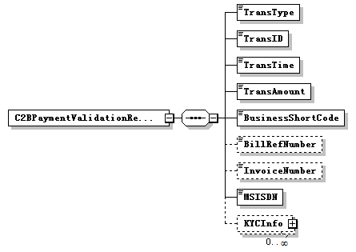
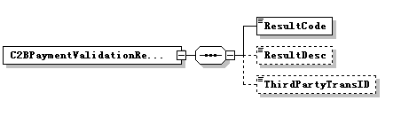
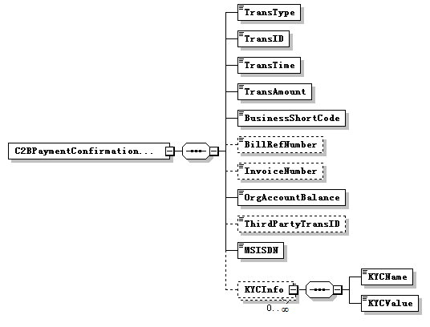

# Payment Overview

When a customer initiates a pay bill service, the system will firstly authorize the transaction (reserve funds) and then sends a validation message to the bill issuer or merchant origination via api. the transaction will only be successful when the third party validation is passed, otherwise it will be cancelled or be kept in "authorized" status.

When the transaction is successfully completed in the mobile money system, another confirmation message will also be sent to the third parties for real-time reconciliation. the confirmation request will be sent for both buy goods and paybill transactions.

# Service Flow

The service flow for this interface shall be as follows


# Paybill transaction validation and confirmation

A customer paybill transaction can be initiated via stk or api channel. the transaction request will be sent the m-pesa system for processing.

After the m-pesa system authorizes the transaction, an external transaction validation request will be sent to 3rd party system via broker. the external transaction validation is optional.

If the correct response (the result code parameter from the third party value is 0) is received from the broker, the mobile money system will complete the corresponding payment transaction. the transaction status will be changed to 'completed'.

If error response is replied by the broker (the result code parameter from the third party value is not 0), the mobile money system will cancel the corresponding payment transaction. the transaction status will be changed to 'cancelled'.

The third party shall be registered in the broker, and must provide a callback url for the confirmation and the validation and a default response when they are unreachable for the validation. this interface is described in the registerurl interface specification below.

After the validation, the m-pesa system will complete the transaction. when the transaction is completed, besides sms notifications will be sent to the customer, a transaction confirmation message will also be sent to the third party system via broker. the third party system will capture the transactions from the confirmation message.

The confirmation message has no effect in the processing of the transaction.

# Interface Specification

The detail of `c2bpaymentvalidationrequest` message from m-pesa to broker describes as following:



| sn | field name | type | example value | optional | description |
| --- | --- | --- | --- | --- | --- |
| 1 | transtype | string | paybill | no | the transaction type name of the buygoods transaction. |
| 2 | transid | string | 1234560000007031 | no | the unique identifier of the payment transaction that is generated by m-pesa system. |
| 3 | transtime | string | yyyymmddhhmmss20140227082020 | no | the date and time when customer initiates a buy goods transaction. |
| 4 | transamount | string | 123.00 | no | the amount of the transaction. two decimals fixed point number.  fixed currency type: kes  e.g. 123.00  stands for: 123.00 ksh |
| 5 | businessshortcode | string | 12345 | no | the organization short code of the merchant in the m-pesa system |
| 6 | billrefnumber | string | tx1001 | yes | this field is not applicable for buy goods transactions. it will always be blank. |
| 7 | invoicenumber | string | x334343 | yes | invoice number as entered by identitythis field is reserved. it will always be blank in current delivery. |
| 8 | msisdn | string | 254722703614 | no | the customer's msisdn, which is with country code prefix. |
|
 | kycinfo | the customer's kyc information, maybe multiple kyc info. |
| 9 | kycname | string | [personal details][first name] | yes | this kyc indicates the customer's first name |
| 10 | kycvalue | string | hoiyor | yes | the value of kyc field |
| 11 | kycname | string | [personal details][middle name] | yes | this kyc indicates the customer's middle name |
| 12 | kycvalue | string | g | yes | the value of kyc field |
| 13 | kycname | string | [personal details][last name] | yes | this kyc indicates the customer's last name |
| 14 | kycvalue | string | chen | yes | the value of kyc field |

Only the kyc fields of the customer name are fixed used here. that is, [personal detail][first name], [personal detail][middle name] and [personal detail][last name].

Sample of Soap Message:

```xml 
<soapenv:envelope xmlns:soapenv="http://schemas.xmlsoap.org/soap/envelope/" xmlns:c2b="http://cps.huawei.com/cpsinterface/c2bpayment">

<soapenv:header/>

<soapenv:body>

<c2b:c2bpaymentvalidationrequest>

<transactiontype>paybill</transactiontype>

<transid>1234560000007031</transid>

<transtime>20140227082020</transtime>

<transamount>123.00</transamount>

<businessshortcode>12345</businessshortcode>

<billrefnumber></billrefnumber>

<invoicenumber></invoicenumber>

<msisdn>254722703614</msisdn>

<kycinfo>

<kycname>[personal details][first name]</kycname>

<kycvalue>hoiyor</kycvalue>

</kycinfo>

<kycinfo>

<kycname>[personal details][middle name]</kycname>

<kycvalue>g</kycvalue>

</kycinfo>

<kycinfo>

<kycname>[personal details][last name]</kycname>

<kycvalue>chen</kycvalue>

</kycinfo>

</c2b:c2bpaymentvalidationrequest>

</soapenv:body>

</soapenv:envelope>
```

## Paybill Transaction Validation Result from broker to M-Pesa

The detail of `c2bpaymentvalidationresult` message from broker to M-Pesa describes as following:



| sn |field name |type |example value |optional |description |
| --- | --- | --- | --- | --- | --- |
| 1 | resultcode | string | 0 | no | the result code of the authorization. 0 for success, others are error code. |
| 2 | resultdesc | string | "service processing successful" | yes | error message when error occurs. |
| 3 | thirdpartytransid | string | 1234560000088888 | yes | the unique identifier of the payment transaction that is generated by the third partythis field is reserved. the m-pesa system can accept the validation result with this field, but the system will not process the field in current delivery. |

The M-Pesa system regards the resultcode 0 as success. other result code are;

| **resultcode** | **resultdesc** |
| --- | --- |
| c2b00011 | invalid msisdn |
| c2b00012 | invalid account number |
| c2b00013 | invalid amount |
| c2b00014 | invalid kyc details |
| c2b00015 | invalid shortcode |
| c2b00016 | other error |

Sample of Soap Message:
``` xml
<soapenv:envelope xmlns:soapenv="http://schemas.xmlsoap.org/soap/envelope/" xmlns:c2b="http://cps.huawei.com/cpsinterface/c2bpayment">

<soapenv:header/>

<soapenv:body>

<c2b:c2bpaymentvalidationresult>

<resultcode>0</resultcode>

<resultdesc>service processing successful</resultdesc>

<thirdpartytransid>1234560000088888</thirdpartytransid>

</c2b:c2bpaymentvalidationresult>

</soapenv:body>

</soapenv:envelope>
``` 

Please refer to the cbpinterface\_c2bpaymentvalidationandconfirmation.wsdl file in section "7 annex" to see the schema definition.

# Paybill Transaction Confirmation Request from M-Pesa to broker

The detail of `c2bpaymenconfirmationrequest` message from m-pesa to broker describes as following:



| sn  | field name  | type  | example value  | optional  | description  |
| --- | --- | --- | --- | --- | --- |
| 1 | transtype | string | buygoods | no | the transaction type name of the pay bill transaction. |
| 2 | transid | string | 1234560000007031 | no | the unique identifier of the payment transaction that is generated by m-pesa system. |
| 3 | transtime | string | yyyymmddhhmmss20140227082020 | no | the date and time when customer initiates a buy goods transaction. |
| 4 | transamount | string | 123.00 | no | the amount of the transaction. two decimals fixed point number.  fixed currency type: kes  e.g. 123.00  stands for: 123.00 ksh |
| 5 | businessshortcode | string | 12345 | no | the organization short code of the merchant in the m-pesa system |
| 6 | billrefnumber | string | tx1001 | yes | this field is not applicable for buy goods transactions. it will always be blank. |
| 7 | invoicenumber | string | x334343 | yes | invoice number as entered by identitythis field is reserved. it will always be blank in current delivery. |
| 8 | orgaccountbalance | string | 12345.00 | no | the available balance of the organization's account for the buy goods transaction (the credit party account of the transaction). two decimals fixed point number.  fixed currency type: kes  e.g. 12345.00  stands for: 12345.00 ksh |
| 9 | thirdpartytransid | string | 1234560000088888 | yes | the unique identifier of the payment transaction that is generated by the third party this parameter only be present when thirdpartytransid was returned from the validation response message.this field is reserved. it will always be blank in current delivery. |
| 10 | msisdn | string | 254722703614 | no | the customer's msisdn, which is with country code prefix. |
|
 | kycinfo |
 |
 |
 | the customer's kyc information, maybe multiple kyc info. |
| 11 | kycname | string | [personal details][first name] | yes | this kyc indicates the customer's first name |
| 12 | kycvalue | string | hoiyor | yes | the value of kyc field |
| 13 | kycname | string | [personal details][middle name] | yes | this kyc indicates the customer's middle name |
| 14 | kycvalue | string | g | yes | the value of kyc field |
| 15 | kycname | string | [personal details][last name] | yes | this kyc indicates the customer's last name |
| 16 | kycvalue | string | chen | yes | the value of kyc field |

Sample of Soap Message:
```xml 
<soapenv:envelope xmlns:soapenv="http://schemas.xmlsoap.org/soap/envelope/" xmlns:c2b="http://cps.huawei.com/cpsinterface/c2bpayment">

<soapenv:header/>

<soapenv:body>

<c2b:c2bpaymentconfirmationrequest>

<transactiontype>paybill</transactiontype>

<transid>1234560000007031</transid>

<transtime>20140227082020</transtime>

<transamount>123.00</transamount>

<businessshortcode>12345</businessshortcode>

<billrefnumber>tx1001</billrefnumber>

<invoicenumber></invoicenumber>

<orgaccountbalance>12345.00</orgaccountbalance>

<thirdpartytransid></thirdpartytransid>

<msisdn>254722703614</msisdn>

<kycinfo>

<kycname>[personal details][first name]</kycname>

<kycvalue>hoiyor</kycvalue>

</kycinfo>

<kycinfo>

<kycname>[personal details][middle name]</kycname>

<kycvalue>g</kycvalue>

</kycinfo>

<kycinfo>

<kycname>[personal details][last name]</kycname>

<kycvalue>chen</kycvalue>

</kycinfo>

</c2b:c2bpaymentconfirmationrequest>

</soapenv:body>

</soapenv:envelope>
```

### Paybill Transaction Confirmation Result from broker to M-Pesa

The `c2bpaymentconfirmationresult` message from broker to m-pesa is free text, no functional usage of this free text. it is only recorded in back-end log file in the m-pesa system for traceability.

Sample of Soap Message:
```xml 

<soapenv:envelope xmlns:soapenv="http://schemas.xmlsoap.org/soap/envelope/" xmlns:c2b="http://cps.huawei.com/cpsinterface/c2bpayment">

<soapenv:header/>

<soapenv:body>

<c2b:c2bpaymentconfirmationresult>c2b payment transaction 1234560000007031 result received.</c2b:c2bpaymentconfirmationresult>

</soapenv:body>

</soapenv:envelope>
```

## Register url Interface Specification

## Interface Introduction

This service is for the third party system to register end-points on the broker where the validation and the confirmation messages are sent.

The detail of registerurl message from the third party to broker describes as following:

### data type definition

### identifier type enumeration

List of identitytype values.

| **enumeration** | **description** |
| --- | --- |
| 1 | msisdn |
| 2 | tillnumber |
| 3 | spshortcode |
| 4 | organizationshortcode |
| 5 | identityid |
| 6 | o2clink |
| 9 | spoperatorcode |
| 10 | posnumber |
| 11 | organizationoperatorusername |
| 12 | organizationoperatorcode |
| 13 | vouchercode |

### Parameter Type Structure

| **element name** | **element type** | **optional** | **description** |
| --- | --- | --- | --- |
| key | xsd:string | no | it indicates a parameter name. |
| value | xsd:string | no | it indicates a parameter value. |

### Parameters Structure

| **element name** | **element type** | **optional** | **description** |
| --- | --- | --- | --- |
| parameter | parametertype[1..unbounded] | no | it is used to carry specific parameters for specific transaction or business operation. |

### Reference Data Structure

| **element name** | **element type** | **optional** | **description** |
| --- | --- | --- | --- |
| referenceitem | parametertype[1..unbounded] | no | it is used carry some reference data that mm need not analyze but need to record it into transaction log.. |

### Transaction Structure

| **element name** | **element type** | **optional** | **description** |
| --- | --- | --- | --- |
| commandid | xsd:string | no | the unique identifier of transaction/business operation. max length is 64.eg
          - registerurl
 |
| languagecode | xsd:string | yes | it indicates language. it's reserved. |
| originatorconversationid | xsd:string | no | the unique identifier of the request message generated by third party. it is used to identify a request between the third party and mm. max length is 128. field must start with the organisation short and name of organisation. eg. 232323\_kcborg\_xxxxxx xxxxx must be unique for every transaction.
 |
| conversationid | xsd:string | yes | the unique identifier generated by mm for a previous request message. it is used to support communication multi-times between the third party and mm for one operation/transaction. |
| remark | xsd:string | yes | the remark information about this operation. max length is 255 |
| parameters | parameters | yes | it is used to carry specific parameters for specific transaction or business operation. this service will have one parameter type "responsetype" and the value can either be complete or cancel. this is the action that will be taken in-case the 3rd party validation url registered are not reachable. |
| referencedata | referencedata | no | it is used carry some reference data that mm need not analyze but need to record it into transaction log.- 1. validationurl is the key and the value is the validation service url on the 3rd parties end.- 2. confirmationurl is the key and the value is the confirmation service url on the 3rd parties end.|
| timestamp | xsd:string | no | the timestamp generated by the third party. |

### Caller Structure

| **element name** | **element type** | **optional** | **description** |
| --- | --- | --- | --- |
| callertype | xsd:integer | yes | indicates the type of the caller:
2-apicaller
3-other(reserved). for this service use 2. |
| thirdpartyid | xsd:string | yes | the unique identifier of a third party system defined in mm. it indicates the third party which initiates the request. max length is 20 this parameter is not used in this service. leave it blank. |
| password | xsd:string | yes | this security credential of the thirdpartyid defined in mm. if the password feature for third party is used in mm, then this parameter must be presented in the request message. this parameter is not used in this service. leave it blank. |
| checksum | xsd:string | yes | currently it is unused. it is reserved for api security. this parameter is not used in this service. leave it blank. |
| resulturl | xsd:string | yes | it indicates the destination url where broker should send the result message to. this parameter is not used in this service. leave it blank. |

### Initiator Structure

| **element name** | **element type** | **optional** | **description** |
| --- | --- | --- | --- |
| identifiertype | identifiertype | yes | it indicates the identifier type of the initiator. the value of this parameter must be a valid identifier type supported by mm. for this service use 11. |
| identifier | xsd:string | yes | it indicates the identifier of the initiator. its value must match the inputted value of the parameter identifiertype. this parameter is not used in this service. leave it blank. |
| securitycredential | xsd:string | yes | it indicates the security credential of the initiator. its value must match the inputted value of the parameter identifiertype. this parameter is not used in this service. leave it blank. |
| shortcode | xsd:string | yes | when the initiator is an organization operator, this parameter must be present in the request to indicate which organization the operator belongs to.if the initiator is not an organization operator, this parameter should not be present. this parameter is not used in this service. leave it blank. |

### Primaryparty Structure

| **element name** | **element type** | **optional** | **description** |
| --- | --- | --- | --- |
| identifiertype | identifiertype | no | it indicates the identifier type of the primary party. the value of this parameter must be a valid identifier type supported by mm and must match the inputted value of the parameter identitytype.set as 1 |
| identifier | xsd:string | yes | it indicates a parameter value. |
| shortcode | xsd:string | no | short code of the merchant head office, store or c2b organisation |

### Identity Structure

| **element name** | **element type** | **optional** | **description** |
| --- | --- | --- | --- |
| caller | caller | yes | it indicates the third party which initiates the request |
| initiator | initiator | yes | it indicates the identity who makes the request. an initiator must be one of the following identity types:- sp operator - organization operator(11) notethe value "11"( **organization operator** ) will be used for all the services in this document.|
| primaryparty | primaryparty | no | if business operation/action, this element is not present; if transaction, this can be either the debit party or the credit party according to the transaction type. the value "1" (customer) |

### Request Structure

| **element name** | **element type** | **optional** | **description** |
| --- | --- | --- | --- |
| transaction | transaction | no | it indicates a transaction. |
| identity | identity | no | this section is used to specify all identities involved in the request |
| keyowner | xsd:integer | no | it indicates which key is used to encrypt the elements initator.securitycredential and the encryptedparameters. its value are enumerated as follows: 1:the api caller's key 2:the initiator's keyfor this service use 1. |

### Message Header: requestsoapheader

| **element name** | **element type** | **optional** | **description** |
| --- | --- | --- | --- |
| spid | xsd: string | no | sp id.this is the service provider identifier that is allocated by the broker to the 3rd party. [example] 000201 |
| --- | --- | --- | --- |
| sppassword | xsd: string | yes | this is an encrypted form of the sp password issued to an sp when an account is created on the broker.the encrypted password is a base64 encoded string of the sha-256 hash of the concatenation of the spid, password and the timestamp as illustrated below:given the following parametersspid: 601399password: sppasswordtimestamp: 20130702212854sppassword = base64(sha-256(spid + password + timestamp)) e.g.sppassword = base64(sha-256(601399sppassword20130702212854)[example]e6434ef249df55c7a21a0b45758a39bb |
| serviceid | xsd: string | yes | service id.this is the service identifier that is allocated by the broker for every service created.[example]3500001000012 |
| timestamp | xsd: string | yes | time stamp (utc time).the value is required during sha-256 encryption for sppassword. noteif the sppassword parameter must be set, this parameter is mandatory. [format]yyyymmddhhmmss[example]20100731064245 |

### Response Structure

| **element name** | **element type** | **optional** | **description** |
| --- | --- | --- | --- |
| responsecode | xsd:string | no | it indicates whether mm accepts the request or not. |
| responsedesc | xsd:string | yes | its value is a description for the parameter resultcode. |
| conversationid | xsd:string | yes | the unique identifier generated by m-pesa for the request message. |
| originatorconversationid | xsd:string | yes | the unique identifier generated by the third party for the request message. |
| servicestatus | xsd: integer | yes | it indicates the mm service status. |

### Instance

- **request** messages
```xml 

<soapenv:envelope xmlns:soapenv=" [http://schemas.xmlsoap.org/soap/envelope/](http://schemas.xmlsoap.org/soap/envelope/)" xmlns:req=" [http://api-v1.gen.mm.vodafone.com/mminterface/request"](http://api-v1.gen.mm.vodafone.com/mminterface/request%22)>

   <soapenv:header>

      <tns:requestsoapheader xmlns:tns=" [http://www.huawei.com/schema/osg/common/v2\_1"](http://www.huawei.com/schema/osg/common/v2_1%22)>

         <tns:spid>151515</tns:spid>

         <tns:sppassword>odexnercmdlcnjvdrkyxqufcnze5mke1oeqymjjdmzk1rufcnzgwmjk2ode4rjk1ote2mefgndu1qkrcmdkymg==</tns:sppassword>

         <tns:timestamp>20140730093620</tns:timestamp>

         <tns:serviceid>151515001</tns:serviceid>

      </tns:requestsoapheader>

   </soapenv:header>

   <soapenv:body>

      <req:requestmsg><>

    <transaction>

        <commandid>registerurl</commandid>

        <originatorconversationid>reg-266-1126</originatorconversationid>

        <parameters>

            <parameter>

                <key>responsetype</key>

                <value>completed</value>

            </parameter>

        </parameters>

        <referencedata>

           <referenceitem>

                <key>validationurl</key>

                <value> [http://10.66.49.201:8099/mock</value>](http://10.66.49.201:8099/mock%3c/value%3e)

            </referenceitem>

<referenceitem>

                <key>confirmationurl</key>

                <value> [http://10.66.49.201:8099/mock</value>](http://10.66.49.201:8099/mock%3c/value%3e)

            </referenceitem>

        </referencedata>

    </transaction>

    <identity>

        <caller>

            <callertype>0</callertype>

            <thirdpartyid/>

            <password/>

            <checksum/>

            <resulturl/>

        </caller>

        <initiator>

            <identifiertype>1</identifiertype>

            <identifier/>

            <securitycredential/>

            <shortcode/>

        </initiator>

        <primaryparty>

            <identifiertype>1</identifiertype>

            <identifier/>

            <shortcode>898942</shortcode>

        </primaryparty>

    </identity>

    <keyowner>1</keyowner>

</request>]]></req:requestmsg>

   </soapenv:body>

</soapenv:envelope>

-   **response** messages

<soapenv:envelope xmlns:soapenv=" [http://schemas.xmlsoap.org/soap/envelope/](http://schemas.xmlsoap.org/soap/envelope/)" xmlns:req=" [http://api-v1.gen.mm.vodafone.com/mminterface/request"](http://api-v1.gen.mm.vodafone.com/mminterface/request%22)>

   <soapenv:header/>

   <soapenv:body>

      <req:responsemsg><![cdata[<?xml version="1.0" encoding="utf-8"?><response xmlns=" [http://api-v1.gen.mm.vodafone.com/mminterface/response"><responsecode>00000000</responsecode><responsedesc>success</responsedesc><conversationid></conversationid><originatorconversationid></originatorconversationid><servicestatus>0</servicestatus></response>]]></req:responsemsg](http://api-v1.gen.mm.vodafone.com/mminterface/response%22%3e%3cresponsecode%3e00000000%3c/responsecode%3e%3cresponsedesc%3esuccess%3c/responsedesc%3e%3cconversationid%3e%3c/conversationid%3e%3coriginatorconversationid%3e%3c/originatorconversationid%3e%3cservicestatus%3e0%3c/servicestatus%3e%3c/response%3e%5d%5d%3e%3c/req:responsemsg)>

   </soapenv:body>

</soapenv:envelope>

1.
# annex

the attached is the wsdl file adopted for buy goods external validation confirmation.

![](data:image/png;base64,ivborw0kggoaaaansuheugaaahiaaabhcaiaaaddgzmfaaatzkleqvr4no2dc1gu1d/hz2fbwvrak4vgfu3wkpgxv0rkksirvhsltjq009s8vg/595lmtsfzuvpyur4ihzfwkiaoof0xw8urqacq+frpedfavbqqlmu+391t07g7ozs7lsi6v8/js5yzoxpmd37nd873njmdvavt6ticebtrads1ehxqwcsjira2dsaigidsczingiaiwgpingiciagrinkgciigribkgyaigrackg1crwrlzxl4edg6oijdxv0t7ysdg4njruufujk5orerebdv365jgwmirkoyqagijubj6emp4iu5lzwv+lx169bevxshdbiadffrke3tiwh7ggsdubdynzg7o3n/vvch8xlffye0wn1pwylnmzzns0tdojq0ljydhdoh2saigicsggsduc3mlho6wzgra1qto7oza5s2bza+dojqm888q7eqcbvcskgofdfhebcmxdn58ivfithgcnpfxd1s34fit/ck2r1798cb+jsjb6eqsdyidsh5nep/utnjyrazt39zcm/awl/9wedyljczks8+hvspm7rkw/c8gychhdlr/hxhqmterkqjiymfjveeurcg2saigicsggsdipt8eapko5/yktjp0q5tz91y15/ha3fpd5sfm7khstokkzjzfs/sxtoqokaa6tn73/ft5hvp0qvatzogaggsdull/hxpcppxyqudeogpc8n188krdqzl5mjzc0rrbp3dssl/hfstwq7b/+z57ygxplvvlckcgurvq1d7lhne7ucyqagzhf88y6tju1apffpf7pmc7hxl+pfvlfh6l8l7dw1jchvlk0efr7kp1z46ytn2nuh/mvp1no7n51el1hnerucyqraeqvgbyqahwv75utxaiwxe7zst95qhtf/h4uon/7n/y/nkhip6zxzdntdsxzw7bombjc4d/kudooyhvfub5c8u7mj+q4ogvaxjbqe2dewumgyu3ijgp0prlwunvvo7cvs/jyfr3vx+9ds8mxbxrn22etvky++vc92rvvb4w38xjrurp/n8tgerptbqqrc1bmkgos6mxtvqcpo39yb4haz3yknoy0a6am3wucowxl+vnjp+2qandeq0lvxpit5defvieyp8cickw+9vkgyq6orkg1azuqbu5/anql2uujbj5dg2sj8478l17cwljxilhkfktmx6z6py/wdj8vxdxa7yhpiax+o7heqh0ccigicsggsduc06tlfc6s4jfesyxn6jygqy4tdcorxkmjw8od3yx9vrr2z8csypm8z/uglbplkqbbbqq8f/zkfgd01z9w7srkwfsfv7vzs10x9vh8j5tyhclpoy2xtblxy9v6ucn52j//zuxydufb5x7qrp1xf75ntns+jxbqfcsdyi1fhpekftyuwf0sduu50qhca1mjza8gjg1a+x1sem6y939ztp+encwnr66pppf4ubutw8+/lcpp93wxtsdekdkgwqbeeqvkcyqail+59gvfbnnsafhnp19i180xpwyv2+2ywc9+o+7i5vttf/9lrptdu/b3hzn/rhapo1pld8uerh4uh7et3+0g0nidobyqahwnscztmxraopjvmd90auj5brxwufumdhpyrgy9r6a8qaybph71y6wgwdqrq0+d+nlr7soxxz2rwbigoxkg1chfy14qjwetu4ucmr3m7rxi/rertzqfr3d7in++ywxul2mv8zbfzvvntxatx0ag+kwzeppg9seqtjbkeqbgefjbue6mblbp2nxq2q+xykfqune9zis9+n/11cbzmwz7+xzmpvkwhmvxcz973dyfhtk1puekqdzinqmzqdc0/8crp0ojgo+y/xg1dm7kqrybaqhwsduchvhs9/fgfxcfhb4a/wke0eys+qbbaeqrbwqljbqa39mw2wel3jjlhuoo9neqrhskgofln5khhuixnbiidubckgoskwvqiu1v/7e0f13yspftoyav0+cbxaoepqkvmi4tggzimgcikwapinql00andahqv5enrzsdscsatinggvmxlksd8/pw8p/q+k/ppsh8dp9heqtn/pel83xt8ccxr0vhv3bo0zsxb1fjinqkx8n4hatoig7busdekrrudfmcwigobkgyaigrackg2ciajcckg2apbtp0+phj06kyurr48eawlptw0oiqshb4ekpkqxx3xris+2bdtefvlle39v4+hugnqbkebolxn1dqt7ki2ehiq1a9acpxtwp9o1bnksnp0zzw47bf+zhkurq7e3d79+/ryuxniksrojoy4ulh06dbgxyst48em1gs2uxbugdx9exfym/uuxln3nnxdqypijeyb4+phs2rspsrkyhi4hrmjr2dnzs2fppndggfarjyymrk3d3nzyiwu+fajvucyff/7zvhnzlvu2vptss/zozzs3dxs2lc8vz9ptu2y5zwvlqhjcxnzagqntyphtc0xoto6kitqxy8egqymevdsgragprtglbo5sizz8kz7y2ifsvp322+jw06dpx7t2lzt52lfj5exlwgyff/75kcfdebyzmznvv/8+xoxdu3cljw4epligogd79u2tjk26cemgrs/o6oimjiw2bdrs27cvjcre2oafcxzglhqehq7a+jmnt6it+vv7kzjxwqqdnxnyznq3ntuvhoinjyur4upj+amkfpgqamqtfet5exkfbwdjvbxkbjaxu75m8dygrprgj61ed/369zb5tkotzmnix1ogsbcgxjjbecacnedzgqv7sofxcn0dq9iaaqpyns6doxvlcxd3x9qscctl5cuxp02bzntu10bqufbots5xx33fhjwwrhadcfojl7/8ermvzfajk2csruxcq7doqjsufedhr5z+7733lixzijyqzid1cqowwjt5k08+wzszntesmclmmdhdqjlrdqiv6cgzw5crvrifwgveg829cepgmjiywslcpk2bkihewas5fu0zwl5gqw+yo+z8blvsv8nqumyg+xv37s3hsuvks0sx0zr3ncagact60umodg7ff/89jilyhxts2hhdunwsz3tv3v3spuvdhw8fmwkem5tbbm4uz5jlrfix4s6do2+++eznn31wv359vsl58+dxrlyjzb6rqysg39dquoxn5xyxfyo9a9cu5gd3afayzvf8cgpprfmzehmtmqt07dsxodl+0wspcbsvgqyt1mzty/ehahwux78obdq0arowlywbhitzp1ywgnrgpt179ixatagzwejq4swlgzzsibxmh3/80avlfwgsnc9dczktlz6epmxklophj2pwyrne2ibjhw4dyldeoi2eco84q4fqvjdv3ktlmt7xec3qnh6mbmgj4eaejgutw7eeoxpmsghdhjcwrskdoyjn1ojjj59egmtemseaq4wcvqbawtneipsaaa+rhyhmwrdmfh716lwyhazms5ikwygrv69md7nt0tlcwsiq5+g+p//8m2zozs5u1qwzzobv9emhkl1q12xjxikty8amkc7z66+/hjx48n69e1lzwqidulg4idicawpnhcuchc2ksmjsffz48sgto0+doovi+vrrr/myw4ci4qyzveangmfe+/jjjxhi7nabb7ybymyynz02+omnn4zodxz2rp7g4gbmndcojro1cuhfdshypuux4hnhis5j8vokhmwduh/uueeee5t5ulq6tzo0iy6orq152ua6mjksnw4j27jly9aswtn37lxuqm3btrgijsbgxqij2cnt6yrlbklu3boljycz2uapx2ji5+fhfylrfqjgriezug5isahgnjxileg0qforhhzzztcyxodtxr16ht58gkmphk6htonwlbefhw+pcyy7sxi5hlihcajelsygkdjrtxubeua9hpmxieyczolfgq187u3tjsj64ycfmgykpqa2b98egzhssgbjuy6yhr4evmxlfqgde0tp59sxdv02ioqkgjdulj0hmwi0d6al165dq5nhreqij0lymfuokcjajgznzp3ffvutuxlq0kz/0xmmoqeqdgeikn79+ignbakah9fatwqfyjawvwjb6ngj33rrlx5z/fr1macrijqb6asvzyqcrzewrtt9+jquj9ypzifmqomodoxawe7u7rdv34zkcd2obkw/t5s2dfiwefjkrk6wow7con7t0hwx2vk4cq6ljsozuvqrr7wipcrrfqjgah799ddzaz3xxbpwiya2bykqfphff2xszmo8cutikivlheoyuzqeoxmgag97ki6jiceahnkxlh0wt5sohcuqumytnka9rk6ecioc/uc1gdroehoqs0m/oedz589nm5iaogswxpidm562bvhzlyaqvvdxzqnxfoxkfek8wkhi0oeevp1qecwkmxphj06cobftj3iw99y3b1///v3nlyogzam0d0ljiblsv/3229gjr/ly4b9obczeteppnddvhqinpmkmfn7xeut10y90svzlcdmo4gxfhutfw758owzjwv3kfgiuouyhnhto3xfftupkwolczwqeblae/ixp3hkh26urlrolmprmnz4ddchpmihchufribyqbquyksnh8pvcmvpzgzyhmsi7jox2kzcduzpc9be05l/txhkwh1itwjxrohywq0ixtdky9ho5ecipcvid1wkymwpgdmyitfrtxysxit/y/p3337ej3w4epjhlq1tg8grn+uijj/ivvcuqshfqumxg9zqzmskzc8uwltftmhryi7uqgxatyu6xgrgitqydhc3p89hjj0mfiybddryswncpuycsqdgvfxzr+ohm4lpgyheublasajdzqucby2ovd81vbxwbztglsshoft5zmfkzk5otacnsfzfzuv7+/jbsz549uhrnzp2f8z4j482biwrvy/thklufgvly8vv+i0gtx0mrrwlvvdxgjru3bt3as2dptuf48eoygi9evji3ypyljgphmysuwwsr014jj0i4rq7nhrgwgygbccrofazq06cpmoeghribvo3atemfj2fv8eyzz3766adyuhz44yeqn05gcnkldd1udt8mls0nbsan//xr12xeq5epwhcdld/ezotchqvse0fw8uoppy5atcgmjgzpdgfcq4jfrkwso/zyr2xruwvlzvfruufbqrbxxfj9kfedjpjokseohtt06ndklsvllczemzonwoozldgohdgaetk9zs1hvciy8wph1bnnz8os0nqqhozugrkz/cbs2gprkutkznqie1t+dpl29szsffstfhnxohywq0izttwhrava3odc4gtobgsdlsp69u0l0ul/4pcadb8fh/q1pz+/eqy4gsfkl9r12cceyufonrjvzs6c+cillzrs2bdradqsbjzpc/pmzby8pdrbenr6unxrjkyyikdknsuq82t3gmkskpk6detwwlqkseukszngvdeuxuncqnddwsjcdp9udpjlp6amitqys7nxr14tpbqbgztnzpwepxogtvjfrpxrwxqupvzxrl3dhjt/cdhwrvrxlzeo86fedvq0ang/f/+pu6c+9drtmazk9a+pmicbtrrnki3iyeimilnmzzjvvcjjxo0bo3zschbwr169fvnllw0bnsgs0nqqntmzzw8dohqf9u7d+/dhw4mjiuz30krzv349ri7hvbvpnl2cfzgkamexhjrzw3nitkdnfb5jxw7ikpbo0ay4gfqkpqn7pg3zwlt2lfroxiktwwz0ndgwpos0olvbtrbfygjzc3vdnjjdk/irvq2ci+fpn3/nzh13d/fu3bslzwoiacwvwrdu/cehhxi9cyake0scieeff97iw+jxcxfjxozb8hodbg5u7muvvvzsugjjeds+vr5ylicsctdchkmkcfb+jgnneb0vpz9/xowzgmghdbnczmoqa0k76rvvvsnnwfgynx8v55/4kfchdhu4wzd8xn311rurvshyzf0oc7jrs2fpx44d2t0h02/qsrtvckannjwcwhlr1q3q0fd4gcejp0btq3giiiisehlq6bcvxoskqw8wakubaqvnsunb+g60hzedjbt4aod0lardsig1nypec9rw5wx++qk9ksoqcnfxyfmhgiafohiqa5bb2dl579698cfoefrppye2bl/felix7ea2mjn6z4douennyoaorkdho+xm5ut3e26igth9f2yezudotyx2oqhz586jhku1pzvgviloturr7chlpuqkq8pp/+c7t/qf9m0f0tyyhum43vzfrwopilrqpvhm0rmmib6skndikqozxjigaqfotaekov831mcba/n9ei6srov0ccmw1vqqz969pnuki0sibw3rc86gytbrloaxcgokhgddvxpvunm4cep9+/elli/hfdv6ftm7ka3cfnovvnxbmetkssjyhhlrbrtceiqtidmws9gp+9rnkisr8/lymjmz4+pju1jsatscgibsdmmgxvkvxr3anses+fn5aqebwkfpnz+/t58+tw0oqra2hmsdsdhnmzfn7witbphoqbjbearbwahjbkeqbgefjbseqrcefzbsearbefzaskeqbefyackgqraeyqukgwrbeiqvkgwqbeeqvkcyqraeqvjb/wowjvlfhgztywaaaabjru5erkjggg==)

|
 |
 | 4 |
| --- | --- | --- |
```
